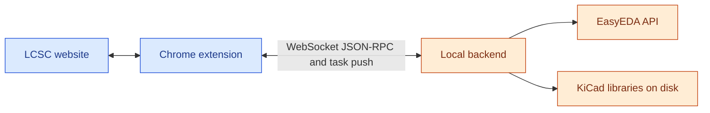

# KiCad Parts Importer

**Version 2.0.0** · Chrome extension for [LCSC](https://www.lcsc.com/) with a **local backend** — import symbols, footprints, and 3D models into KiCad libraries using EasyEDA-sourced data, with optional **custom KiCad symbol templates**.

> [!WARNING]
> EasyEDA source data can contain errors. **Verify pins and footprints** before using converted parts in production.

<p align="center">
  
</p>

## Architecture & data exchange



| Path | What flows |
| --- | --- |
| **LCSC ↔ extension** | The **content script** reads product pages and renders download UI; user actions trigger messages to the **service worker**. |
| **Extension ↔ backend** | The **service worker** opens one **WebSocket** to **`/ws/extension`** (`ws://` or `wss://`, same **host and port** as **API base URL**, e.g. `http://localhost:8087` → `ws://localhost:8087/ws/extension`). Requests use **JSON-RPC**-style methods (enqueue jobs, health, library/fs helpers, template pin-check, etc.). The backend **pushes** **`task_update`** (and related) messages so job progress reaches the UI **without polling**. |
| **Backend ↔ EasyEDA / disk** | The Python server fetches EasyEDA CAD data and writes symbols, footprints, and 3D files into the library paths you configure. |

There is **no separate HTTP REST API** for application logic: extension and backend coordinate **only** on that WebSocket (aside from the browser loading normal LCSC pages).

## Overview

- **Extension** (Chrome, Manifest V3) adds controls on LCSC and a **popup** for libraries and settings.
- **Backend** (Python, same repo) performs conversion and talks to EasyEDA; it stores files under your chosen library folders.
- Details of the wire protocol are summarized in [Architecture & data exchange](#architecture--data-exchange) above.

## Contents

- [Architecture & data exchange](#architecture--data-exchange)
- [Getting started](#getting-started)
- [Understanding settings & parameters](#understanding-settings--parameters)
- [Import workflow on LCSC](#import-workflow-on-lcsc)
- [Templates & metadata](#templates--metadata)
- [UI screenshots](#ui-screenshots)
- [Repository layout](#repository-layout)
- [Development](#development)
- [Credits & license](#credits--license)

## Getting started

### Prerequisites

- **Google Chrome** (or a Chromium-based browser that supports unpacked extensions).
- **Local backend** running on your machine — required for any import. Use a [release binary](../../releases) or run from source (see [Development](#development)).

### 1. Install the extension

- **Chrome Web Store:** [KiCad Parts Importer](https://chromewebstore.google.com/detail/ojkpgmndjlkghmaccanfophkcngdkpmi)  
- **From source:** open `chrome://extensions` → enable **Developer mode** → **Load unpacked** → select the `chrome_extension/` folder in this repository.

### 2. Install and run the backend

From **Releases**, use the build for your OS (macOS/Linux/Windows). Examples:

- **macOS / Linux:** `chmod +x "./<version>-KiCad Parts Importer-<OS>"` then run the binary.  
- **macOS Gatekeeper:** `xattr -dr com.apple.quarantine "./<version>-KiCad Parts Importer-Mac"`  
- **Windows:** run `"<version>-KiCad Parts Importer-Windows.exe"`

From **source:** use a Python environment with project dependencies, then `python run_server.py` (default port is often **8087** — check console output and align the extension URL).

### 3. Point the extension at the backend

1. Open the extension **popup** → **Settings** tab.  
2. Set **API base URL** to match the server (e.g. `http://localhost:8087`).  
3. Click **Test** to confirm the backend is reachable.  
4. The header should show the backend as connected; if not, check firewalls, proxies, or software blocking **WebSockets** to `localhost`.

### 4. Add or select a KiCad library

1. Open the **Library** tab.  
2. Use **Add** to **create** a new library folder layout or **Import library** to register an existing `.kicad_sym`.  
3. **Activate** the library that should receive imports. Only one library is active at a time.

### 5. Import a part

1. Open an LCSC **product detail** page (`/product-detail/...`).  
2. Use **Download / EasyEDA** for the default LCSC-derived symbol, or **Download / Template** if you use template libraries (see [Templates & metadata](#templates--metadata)).  
3. Wait for the job to finish; the part appears under your active library’s paths.

**List pages** may show a compact download control; the full **Template** choice is on product pages.

## Understanding settings & parameters

Think of two places: the **popup** (configuration and library list) and the **LCSC page** (where you start an import). Parameters from LCSC tables flow into KiCad fields; you control how **Value** and some symbol options are chosen via **Categories** in Settings.

### Library tab (what to configure first)

| Item | Purpose |
| --- | --- |
| **Active library** | All imports write into this library’s on-disk paths. |
| **Add / Create** | Define name, base folder, and whether to create `.kicad_sym`, `.pretty`, `.3dshapes`, plus optional **project-relative 3D** paths (`${KIPRJMOD}` + **3D base path**). |
| **Import library** | Pick an existing `.kicad_sym`; the backend registers it in the list. |
| **Template** switch | Marks a library as a **template library**; symbols inside can be selected on the LCSC page when using **Template** download. |
| **Search / counts** | Filter libraries; summary shows symbol / footprint / 3D counts. |

**3D paths:** Each library remembers project-relative options from **Create** (or import). On import, the **active library**’s values are used; if its **3D base path** is empty, the extension falls back to **Settings → Import defaults → 3D base path**. Changing defaults pre-fills **Add library** but does not rewrite older libraries.

### Settings → Backend & appearance

| Item | Purpose |
| --- | --- |
| **API base URL** | Host and port of the conversion server; drives WebSocket and health checks. |
| **Test** | Verifies reachability (not a full conversion). |
| **Light / Dark** | Theme for the **popup only** (not LCSC). |

### Settings → Import defaults

These apply to **product-page imports** unless you pick a one-off choice in a dialog (e.g. single overwrite).

| Item | Purpose |
| --- | --- |
| **Overwrite footprints & symbols** | Replace existing symbol/footprint files without asking each time when appropriate. |
| **Overwrite 3D models** | Same for 3D files. |
| **Debug logging** | Verbose service-worker logs for jobs and RPC (see [Development](#development)). |
| **Project relative 3D paths** | Default for new libraries and fallback path segment for `${KIPRJMOD}`-based model references. |

### Categories & the Value parameter

**Category name** (each row) is a **lookup key** for LCSC’s category breadcrumb:

- Prefer a **full path** with slashes, e.g. `Passives/Resistors/SMD` (normalized when saved).  
- The extension uses **deepest-prefix matching**: among saved rows, the **longest** key that equals the product path or is a **strict prefix** wins.  
- **Legacy:** a key **without** `/` can match the **second segment** of the path (e.g. `Resistors`), like the built-in defaults for resistors, capacitors, and inductors.

**Value Param** must be the **exact column title** (label) of an LCSC parameter table on the product page. That cell’s text becomes the KiCad symbol **Value** when present. If the column is missing or empty for a specific part, you get a **Value parameter not found** dialog: use the EasyEDA default Value, change the mapping, or cancel.

**Hide pin numbers / Hide pin names** are passed through to conversion for that category match.

**Templates:** You choose the **template symbol** on the **LCSC page**, not in the Categories table. The Library tab only marks which libraries are **template libraries**.

### If LCSC shows a category or value dialog

- **New category:** No saved row matches this product’s path — you can skip once, save for the full path, continue without saving, or cancel.  
- **No parameters:** The script could not read attribute tables — default Value or configure category.  
- **Value mismatch:** Your saved **Value Param** does not appear (or is empty) on this page — default, reconfigure, or cancel.

### Where settings are stored

Libraries, URL, toggles, theme, and the category table live in **Chrome extension storage** and the **service worker**. When the backend is connected, updates sync so conversion uses the same configuration.

## Import workflow on LCSC

When you start a download on a **product page**, the extension roughly:

1. Confirms the **backend** is connected.  
2. If the part **already exists** and overwrites are off, may ask **Overwrite?** (once, permanently, or cancel).  
3. Resolves **category** and **Value** using saved Categories rules and on-page tables (dialogs if needed).  
4. For **Template**, may run a **pin-count check** against EasyEDA; you can continue with constraints or fall back to EasyEDA.  
5. Submits a **job** and shows **progress** on the page until success or error.

Cancelling a blocking dialog returns you to a normal button state; **in library** state is refreshed where applicable.

## Templates & metadata

- Place **`Templates.kicad_sym`** next to your symbol library (or use symbols from a marked **template library**). Typical names include `Template_Resistor`, `Template_Capacitor`, etc.; the picker on LCSC shows what the backend exposes.  
- The merger aligns template **pins** with EasyEDA (add/remove as needed) so electrical sets stay consistent.  
- **LCSC metadata** (datasheet, description, manufacturer, package, and table parameters) is merged from several page structures into KiCad properties; labels are normalized where the extension maps synonyms (power, tolerance, ratings, etc.).

## UI screenshots

| Extension settings | Library management |
| --- | --- |
|  |  |

| Add a library |
| --- |
|  |

Imports are started from **LCSC product pages**, not from the popup.

| LCSC product page | After download |
| --- | --- |
|  |  |

## Repository layout

| Path | Role |
| --- | --- |
| `chrome_extension/` | Manifest V3 extension (content script, service worker, popup). |
| `easyeda2kicad/` | Conversion core, KiCad export, `template_merger.py`. |
| `easyeda2kicad/api/` | FastAPI app — tasks, library checks, templates / pin-check. |
| `easyeda2kicad/service/` | Orchestration (`conversion.py`). |
| `run_server.py` | Run the API locally. |
| `tests/` | Pytest suite. |
| `docs/` | Design notes and extension refactor playbook. |

## Development

```bash
pip install -r requirements.txt -r requirements-dev.txt
python -m pytest tests/ -v
python run_server.py
```

Load **unpacked** from `chrome_extension/` and set **API base URL** to your local server.

**Architecture & regression checklist:** [docs/extension-refactor-strategy.md](docs/extension-refactor-strategy.md)

### CI (GitHub Actions)

[`.github/workflows/ci.yml`](.github/workflows/ci.yml) runs **only when you start it manually** (**Actions** → **CI** → **Run workflow** → choose branch, optional note → **Run workflow**). It does **not** run on every push (avoids noise; use this when you want a checked build).

| Job | What it does |
| --- | --- |
| **Backend** | Python **3.11** and **3.12** on Ubuntu: `pip install -r requirements.txt -r requirements-dev.txt`, then `pytest tests/`. |
| **Extension** | Validates `chrome_extension/manifest.json` (JSON) and runs `node --check` on `background.js`, `contentScript.js`, `popup.js`. |

**Where “version” comes from**

| Context | Source |
| --- | --- |
| **This CI workflow** | Does **not** compute a release version. The first step **prints** the extension **`version`** field from [`chrome_extension/manifest.json`](chrome_extension/manifest.json) and the **Git ref / commit SHA** so the log matches what you built. |
| **GitHub Releases / binaries** | The separate workflow [`.github/workflows/build-backend.yml`](.github/workflows/build-backend.yml) names artifacts from a **`v*.*.*` tag** (version = tag without leading `v`) or `dev-<short-sha>` when not tagging. |

**How to verify the pipeline**

1. **On GitHub:** **Actions** → **CI** → **Run workflow** → branch (e.g. `master`) → optional note → **Run workflow**; open the run and expand **Report versions** / job logs.  
2. **Locally (same commands as CI):**

   ```bash
   pip install -r requirements.txt -r requirements-dev.txt
   python -m pytest tests/ -v --tb=short
   python -c "import json; json.load(open('chrome_extension/manifest.json'))"
   node --check chrome_extension/background.js
   node --check chrome_extension/contentScript.js
   node --check chrome_extension/popup.js
   ```

Release builds (PyInstaller + extension zip + GitHub Release) stay separate: [`.github/workflows/build-backend.yml`](.github/workflows/build-backend.yml) (tags `v*.*.*` and manual dispatch).

### Debug logging

- **Extension:** Enable **Settings → Enable debug logging**, or set `KPI_JOB_TRACE = true` at the top of `chrome_extension/background.js` (temporary). Inspect logs via `chrome://extensions` → **Service worker**.  
- **Backend:** `EASYEDA2KICAD_WS_JOB_TRACE=1` when starting the server (PowerShell: `$env:EASYEDA2KICAD_WS_JOB_TRACE='1'; python run_server.py`).

## Credits

Based on [easyeda2kicad](https://github.com/uPesy/easyeda2kicad.py) by uPesy.

## License

> [!NOTE]
> This repository includes **AGPL-3.0** code from the upstream project; that license still applies to those parts. See `LICENSE`.
