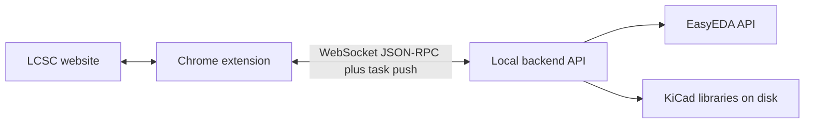
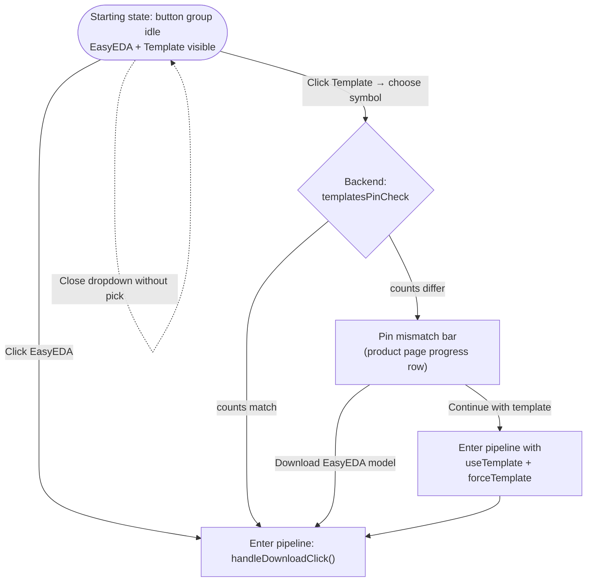
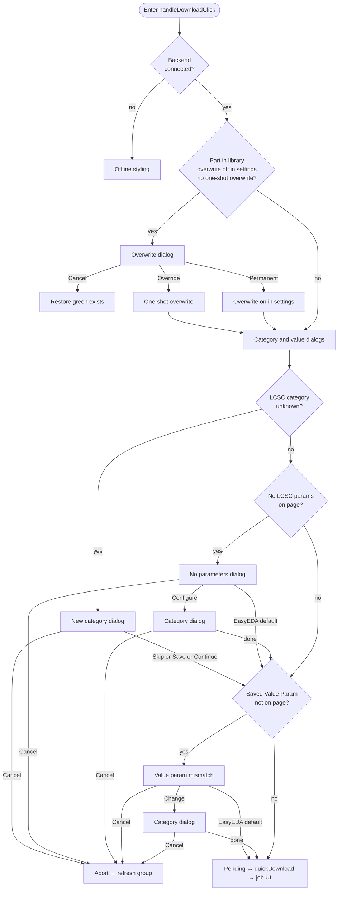

# KiCad Parts Importer

Chrome extension for [LCSC](https://www.lcsc.com/) plus a local Python backend: import components into a selected KiCad library using EasyEDA-sourced data (symbol, footprint, 3D) and optional **your own KiCad symbol templates**.

> [!WARNING]
> EasyEDA source data can contain issues. **Always verify pins and footprints** before using converted parts in production.

<p align="center">
  
</p>



The extension service worker talks to the backend only over **`/ws/extension`** (`ws://` or `wss://`, same host/port as the configured server URL). Job progress is **pushed** (`task_update`); there is **no HTTP polling** for tasks. The Python app exposes **no HTTP REST API**—only this WebSocket.

## Contents

- [Quick start](#quick-start)
- [How downloading works](#how-downloading-works)
- [Product-page flow (diagrams)](#product-page-flow-diagrams)
- [Features in detail](#features-in-detail)
- [UI screenshots](#ui-and-lcsc-website-integration)
- [Repository layout](#repository-layout)
- [Development](#development)
- [Credits & license](#credits)

## Quick start

1. **Extension**
   - [Chrome Web Store](https://chromewebstore.google.com/detail/ojkpgmndjlkghmaccanfophkcngdkpmi), or  
   - Load unpacked: `chrome://extensions` → Developer mode → **Load unpacked** → select `chrome_extension/`.

2. **Backend** (required for import) — from [Releases](../../releases):
   - macOS/Linux: `chmod +x "./<version>-KiCad Parts Importer-<OS>"` then run the binary.
   - macOS Gatekeeper: `xattr -dr com.apple.quarantine "./<version>-KiCad Parts Importer-Mac"`
   - Windows: run `"<version>-KiCad Parts Importer-Windows.exe"`

3. Open [lcsc.com](https://www.lcsc.com/), pick a library in the extension, and use **Download / EasyEDA** or **Download / Template** on **product detail** pages (`/product-detail/...`).

## How downloading works

Rough order on a **product page** (details in [Features](#features-in-detail)):

1. **Backend reachable** (WebSocket to `/ws/extension`) — otherwise the UI shows offline. If the backend is up but the extension stays offline, check **proxies or security software blocking WebSockets** to `localhost`.
2. **Already in library?** If global overwrite is off, **Overwrite?** is asked **first** (Override / Permanent override / Cancel).
3. **Category & value field** — new category, missing LCSC table data, or mismatched saved “Value parameter” → dialogs (Skip / Save & continue / Continue / Cancel, etc.).
4. **Template path** (optional) — choose **EasyEDA** (LCSC) or **Template**; template libraries can expose a dropdown. If EasyEDA and template pin counts differ, a **pin mismatch** flow can appear (continue with template constraints or fall back to EasyEDA).
5. **Conversion** — job runs; success state and optional confetti on the in-page progress UI.

List pages use a compact download button with the same backend checks where applicable (no separate **Template** dropdown — **EasyEDA** path only).

### Product-page flow (diagrams)

Below: **(1)** how you enter the shared download pipeline from the grouped buttons, **(2)** what happens inside that pipeline until a job starts. Cancelling any modal returns to a **ready-to-click** state (green “in library”, blue “download”, or partial — see table).

#### 1 — Entry: EasyEDA vs Template (pin gate)



#### 2 — Pipeline inside `handleDownloadClick` (after entry)

Order is fixed: **backend check → optional overwrite → category/value dialogs → job**.



\*After **New category** completes, the **No LCSC params** dialog is **skipped** (`needsValueParamFromPage && !categoryDialogShown`); flow goes straight to the **Value param mismatch** check (`mm`).

#### 3 — State / phase reference

| Phase | When it appears | User choices | Where you land after |
| --- | --- | --- | --- |
| **Idle (group)** | Default on product page | — | EasyEDA = LCSC import; Template opens searchable list. |
| **Template dropdown** | Template clicked, templates exist | Pick symbol / filter / click outside | **Pick** → pin check; **outside click** → same idle as before. |
| **Pin check** | After template symbol chosen | — (automatic) | Match → pipeline; mismatch → pin mismatch bar. |
| **Pin mismatch** | EasyEDA pin count ≠ template pin count | **Continue (incompatible…)** → forced template import; **Download EasyEDA model** → LCSC symbol path | Enters pipeline with `forceTemplate` or plain EasyEDA. |
| **Backend offline** | `getState` not connected | — | Grey/offline buttons until backend returns. |
| **Overwrite** | `libState === exists` and both overwrite toggles off and not already a one-shot overwrite | **Override** (once) · **Permanent override** · **Cancel** | **Cancel** → green exists, idle. **Override/Permanent** → continue pipeline (Permanent turns overwrite on for later). |
| **New category** | LCSC category not stored yet | Skip · Save & continue · Continue · Cancel | **Cancel** → abort, refresh group (skip idle reset flash). Others → next checks. |
| **No parameters** | LCSC table empty / unread and new-category dialog did not already run | Cancel · Use EasyEDA default · Configure… | **Cancel** → abort. **Configure** → category dialog. |
| **Value param mismatch** | Saved Value Param not on page | Cancel · EasyEDA default · Change… | **Cancel** → abort. **Change** → category dialog. |
| **Job** | All gates passed | — | Progress bar → success (confetti) → auto-switch to exists, or error message. |

> **Note:** After **Cancel** on any blocking dialog, the extension calls `resumeDownloadUiAfterCategoryAbort`: buttons re-enable and library state is re-checked (`refreshButtonGroup` with `skipIdleReset` on the product group) so the UI matches “already in library” when applicable.

## Features in detail

### Per-category symbol settings (extension Settings)

| Setting | Meaning |
| --- | --- |
| **Hide Num** | Hide pin numbers on the generated symbol |
| **Hide Name** | Hide pin names on the generated symbol |
| **Value Param** | Which LCSC attribute fills KiCad **Value** (e.g. `Resistance`, `Capacitance`) |

When a **new LCSC category** appears, a dialog offers **Skip**, **Save & continue** (persist for that category), **Continue** (this import only), or **Cancel**.

If the product **attributes table** cannot be read, you get **Use EasyEDA default** or **Configure value source…** (same options as above).  
If the table was read but your saved **Value Param** does not match any row → **Use EasyEDA default**, **Change value parameter…**, or **Cancel**.

Default rows ship for **Resistors**, **Capacitors**, **Inductors** (hide num/name + typical value fields). Template names are **not** fixed per category in storage; template choice happens at download time when templates are available.

### LCSC metadata → KiCad properties

The content script merges **`table.tableInfoWrap`**, **`v-data-table.common-table-v7`**, and **`paramsItem`** data. Typical mapped fields include **Datasheet**, **Description**, **Manufacturer**, **LCSC Part**, **Package**, plus parameters normalized through a label map (Power, Tolerance, voltage ratings, DCR, etc.) — same idea as in the extension’s parameter mapping tables.

### Template symbols (`Templates.kicad_sym`)

You can place **`Templates.kicad_sym`** next to your symbol library and define symbols such as `Template_Resistor`, `Template_Capacitor`, `Template_Capacitor_Polarized`, `Template_Inductor` (names configurable when picking a template at download).

- **Multiple libraries** can be marked as template libraries; the backend/extension aggregate template symbol lists.
- **Merge behaviour:** the importer aligns the template’s **pin table** with EasyEDA (adds missing pins at the origin, removes template-only pins) so electrical pin sets stay consistent.
- **WebSocket RPC** `templates_pin_check` compares EasyEDA vs template pin counts before conversion; `force_template` on conversion tasks avoids falling back to the raw EasyEDA symbol when you explicitly require the template path.

Required properties on templates include at least **Reference**, **Value**, **Footprint**, **Datasheet**, **Description**; manufacturer/LCSC/JLC and scraped params are appended as hidden fields.

### Network resilience

EasyEDA fetches (component CAD, 3D OBJ/STEP) use **timeouts and retries** with user-visible status where possible.

## UI and LCSC website integration

| Extension settings | Library management |
| --- | --- |
|  |  |
| Backend URL, overwrite defaults, project-relative paths, categories. | Libraries, counts, status. |

| Add a library | Fetch new parts |
| --- | --- |
|  |  |

| LCSC product page | After download |
| --- | --- |
|  |  |

## Repository layout

| Path | Role |
| --- | --- |
| `chrome_extension/` | Manifest V3 extension (content script, service worker, popup). |
| `easyeda2kicad/` | Conversion core: EasyEDA parsing, KiCad export, `template_merger.py`. |
| `easyeda2kicad/api/` | FastAPI app (`server.py`) — tasks, library checks, `templates/pin-check`, etc. |
| `easyeda2kicad/service/` | Orchestration (`conversion.py`). |
| `run_server.py` | Entry point to run the API locally. |
| `tests/` | Pytest (API, template merger, …). |
| `docs/` | Design notes (e.g. template dropdown / pin-check plan). |

## Development

```bash
# Python env with dev dependencies, then:
python -m pytest tests/

# Run API (default port often 8087 — see extension settings / run_server.py)
python run_server.py
```

Load the extension from `chrome_extension/` as **unpacked** and point it at your local server URL.

**Extension architecture & refactor playbook:** [docs/extension-refactor-strategy.md](docs/extension-refactor-strategy.md) (data flow, design tokens, **manual regression checklist**, optional ESLint/bundler notes).

### Debug logging (jobs / WebSocket)

- **Extension:** With **Settings → Debug logs** enabled, the service worker logs **`[KPI jobs]`** (enqueue, `task_update`, merge) and **`[KPI jobs verbose]`** (RPC params/results, `list_tasks`). To trace jobs without the popup, set **`KPI_JOB_TRACE = true`** at the top of `chrome_extension/background.js` (remember to turn it off). Open the worker via `chrome://extensions` → **Service worker**.
- **Backend:** Set `EASYEDA2KICAD_WS_JOB_TRACE=1` when starting the API to log **`[ws-job]`** lines (enqueue, worker pickup, `broadcast` push counts, completion). Example (PowerShell):  
  `$env:EASYEDA2KICAD_WS_JOB_TRACE='1'; python run_server.py`

## Credits

Based on [easyeda2kicad](https://github.com/uPesy/easyeda2kicad.py) by uPesy.

## License

> [!NOTE]
> This repository includes code from the original **AGPL-3.0** project; that license continues to apply to those parts. New contributions are intended to remain **free to use, non-commercial** where separately noted; this does not change AGPL terms for upstream code.

See `LICENSE` (AGPL-3.0).
