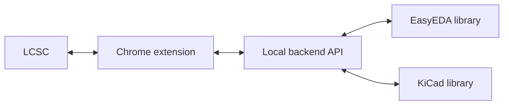

# KiCad Parts Importer

This repo includes a Chrome extension that adds buttons on [lcsc.com](https://www.lcsc.com/) to import components directly into a selected KiCad library. The extension calls a local backend that uses easyeda2kicad to download symbol, footprint, and 3D model data from the EasyEDA library (when available). The backend is required because the extension cannot modify your filesystem or run CLI tools on its own.

> [!WARNING]
> EasyEDA source data can contain issues. ALWAYS CHECK PINS AND FOOTPRINTS before using converted parts in production designs.

<p align="center">
  
</p>



## What is included
- `easyeda2kicad/`: Python conversion engine and backend modules.
- `run_server.py`: FastAPI backend for the extension.
- `chrome_extension/`: Chrome MV3 extension UI that talks to the local backend.

## Quick start
1. Install the extension:
   - Chrome Web Store: [KiCad Parts Importer](https://chromewebstore.google.com/detail/ojkpgmndjlkghmaccanfophkcngdkpmi)
   - Or load locally: open `chrome://extensions`, enable Developer mode, click "Load unpacked", select `chrome_extension/`.
2. Download the backend from the [Releases](../../releases) page and start it:
   - macOS/Linux: `chmod +x "./<version>-KiCad Parts Importer-<OS>"` then `./"<version>-KiCad Parts Importer-<OS>"`
   - macOS Gatekeeper: `xattr -dr com.apple.quarantine "./<version>-KiCad Parts Importer-Mac"`
   - Windows: run `"<version>-KiCad Parts Importer-Windows.exe"`
3. Browse `https://www.lcsc.com/` and use the extension to export components.

## UI and LCSC Website Integration
| Extension settings | Library management |
| --- | --- |
|  | |
| Configure backend URL, overwrite defaults, and project-relative paths. |View existing libraries, counts, and status badges. |

| Add a library |Fetch new parts |
| --- |--- |
|  |  |
| Create a new library and choose output folders. |Request symbols, footprints, and 3D models from LCSC IDs. |


| LCSC part page action |
| --- |
|  |
| Download a single part directly from the product page. |

| LCSC part downloaded |
| --- |
|  |
| Confirms the part is available in the library. |

| LCSC list actions |
| --- |
|  |
| Quick download buttons added to LCSC listing pages. |


## Features

### Category-based symbol settings
In the extension's **Settings** tab, you can configure per-category rules for how symbols are imported:

| Setting | Description |
| --- | --- |
| **Hide Num** | Hide pin numbers globally on the KiCad symbol |
| **Hide Name** | Hide pin names globally on the KiCad symbol |
| **Value Param** | LCSC parameter to use as the symbol's Value field (e.g. `Resistance`, `Capacitance`, `Inductance`) |
| **Template** | Name of a template symbol in `Templates.kicad_sym` (see below) |

The default configuration ships with sensible presets for Resistors, Capacitors, and Inductors:

| Category | Hide Num | Hide Name | Value Param | Template name |
| --- | --- | --- | --- | --- |
| Resistors | ✅ | ✅ | `Resistance` | `Template_Resistor` |
| Capacitors | ✅ | ✅ | `Capacitance` | `Template_Capacitor` |
| Inductors | ✅ | ✅ | `Inductance` | `Template_Inductor` |

### Scraped LCSC metadata as KiCad properties
When a component is imported, the following are extracted from the LCSC product page and stored as hidden KiCad symbol properties:

- **Datasheet** — direct PDF URL from the product page (e.g. `https://www.lcsc.com/datasheet/C126358.pdf`)
- **Description** — full component description text (e.g. `100mW 3kΩ 75V Thick Film Resistor ±1% 0603`)
- **Manufacturer** — component manufacturer name
- **LCSC Part** — LCSC part number (e.g. `C126358`)
- **Package** — physical package / size designation (e.g. `0603`, `0805`, `SOT-23`)
- **All `paramsItem` parameters** — normalized to consistent names via a built-in mapper:

| LCSC label | KiCad property name |
| --- | --- |
| `Power(Watts)`, `Rated Power`, `Power Dissipation` | `Power` |
| `Tolerance (±)`, `Resistance Tolerance`, `Capacitance Tolerance` | `Tolerance` |
| `Temperature Coefficient` | `Temp. Coefficient` |
| `Operating Temperature` | `Operating Temp.` |
| `Voltage Rating - DC`, `Voltage - Rated`, `Rated Voltage` | `Voltage Rating` |
| `DC Resistance (DCR) (Max)`, `DC Resistance` | `DCR` |
| `Saturation Current (Isat)`, `Saturation Current` | `Sat. Current` |
| `Self Resonant Frequency` | `Self Res. Freq.` |
| `Mounting Type` | `Mounting` |
| all others | kept as-is |

### Template symbol system
For Resistors, Capacitors, and Inductors you can provide your own KiCad symbol templates instead of using the EasyEDA-derived graphics. This lets you use your own pin layout, body shape, and reference designator style while the importer fills in all component-specific properties automatically.

#### How it works
1. Create a file called **`Templates.kicad_sym`** in the **same directory** as your configured symbol library (e.g. next to `LCSC_Parts.kicad_sym`).
2. Add one or more template symbols to that file using the KiCad Symbol Editor. The extension looks for these **exact symbol names** (pre-configured by default in the Settings tab):

| Symbol name (exact) | Component type | Reference prefix |
| --- | --- | --- |
| `Template_Resistor` | Resistor | `R` |
| `Template_Capacitor` | Capacitor (non-polarized) | `C` |
| `Template_Capacitor_Polarized` | Capacitor (polarized) | `C` |
| `Template_Inductor` | Inductor / Coil | `L` |

> [!TIP]
> The names are configurable per category in the extension Settings tab. The values above are the defaults. If you rename your template symbols, update the **Template** column in Settings to match.

3. The extension auto-detects these templates on connect. In the Settings tab, each category row shows a **colored dot** next to the template name:
   - 🟢 **Green** — template found in `Templates.kicad_sym`
   - 🔴 **Red** — template name configured but not found
   - ⚫ **Grey** — no template name configured

4. On the LCSC product page, the download button expands into multiple options:

| Situation | Buttons shown |
| --- | --- |
| No template configured/found | `Download / LCSC` |
| Resistor or Inductor with template | `Download / Template` · `Download / LCSC` |
| Capacitor with both templates | `Download / Polarized` · `Download / Non-Polar.` · `Download / LCSC` |
| Capacitor with only one template | `Download / Template` · `Download / LCSC` |

#### Required template symbol properties
Each template symbol **must** contain the following properties (the importer will replace their values). Create them with any placeholder value — they are overwritten at import time:

| Property name | Replaced with |
| --- | --- |
| `Reference` | Kept as-is (e.g. `R`, `C`, `L`) |
| `Value` | Component value from LCSC (e.g. `10k`, `100nF`) or the raw component name |
| `Footprint` | KiCad footprint reference (e.g. `LCSC_Parts:R0603`) |
| `Datasheet` | Datasheet PDF URL |
| `Description` | Full LCSC description text |

The following properties are **appended automatically** after `Description` — you do not need to add them to the template:

- `Manufacturer`
- `LCSC Part`
- `JLC Part` *(if available)*
- All scraped `paramsItem` values (Tolerance, Power, Voltage Rating, etc.)

#### Example minimal template
Open the KiCad Symbol Editor, create a new library file called `Templates.kicad_sym`, draw your desired resistor body and pins, then add these properties:

```
Reference   →  R
Value       →  placeholder
Footprint   →  (leave empty)
Datasheet   →  (leave empty)
Description →  (leave empty)
```

Save the file next to your symbol library. The extension will detect it automatically on the next backend connection.


## Project layout
- `easyeda2kicad/api/`: FastAPI server routes.
- `easyeda2kicad/easyeda/`: EasyEDA parsing and fetching.
- `easyeda2kicad/kicad/`: KiCad export logic, including `template_merger.py`.
- `easyeda2kicad/service/`: Conversion orchestration.
- `tests/`: API and conversion tests.

> [!NOTE]
> This repo includes fixes for several EasyEDA conversion edge cases and improves overall stability when exporting libraries.


## Credits
This project builds on the original [easyeda2kicad](https://github.com/uPesy/easyeda2kicad.py) work by uPesy

## License

> [!NOTE]
> This repository includes code from the original AGPL-3.0 project, so the AGPL-3.0 license applies to that code. My intent for new contributions is "free to use, non-commercial only"; this note does not change the licensing of the original code.
> 
AGPL-3.0. See `LICENSE`.
