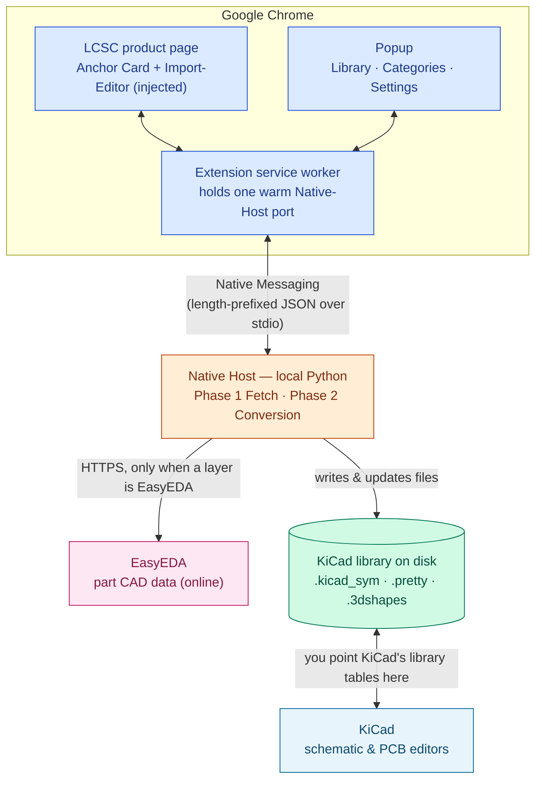
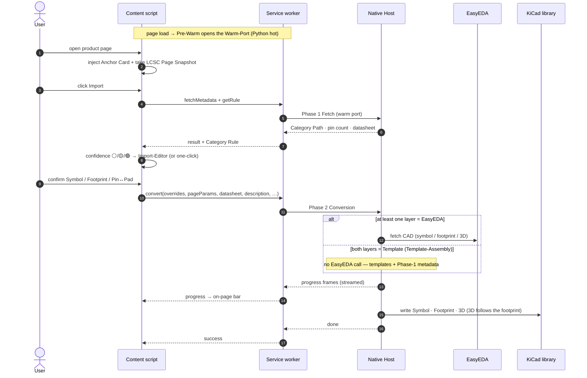

# KiCad Parts Importer

**Version 3.0.0** · A Chrome extension + local helper that imports **symbols, footprints, and 3D models** from [LCSC](https://www.lcsc.com/) product pages straight into your **KiCad** libraries — using EasyEDA-sourced CAD data, with optional **custom KiCad symbol/footprint templates**.

> [!NOTE]
> **This README documents V3** (the current rebuild on branch `v3/rebuild`, manifest `3.0.0`). V3 replaces V2's standalone WebSocket server with a **Native Host** launched on demand through **Chrome Native Messaging** — there is **no server to start, no port, and no "API base URL"** to configure. The deeper design lives in [`CONTEXT.md`](CONTEXT.md) (domain language), [`V3-SPEC.md`](V3-SPEC.md), and [`docs/adr/`](docs/adr/).

> [!WARNING]
> EasyEDA source data can contain errors. **Verify pins and footprints** before using converted parts in production.

> [!CAUTION]
> **Set LCSC to English before importing.** The importer reads each part's metadata from the LCSC product page **in its display language**. On a non-English session the symbol Properties come out localized **and template auto-matching breaks** — a page showing "Widerstände" never matches a template tagged `Resistors`. Switch LCSC to **English**, reload the page (the extension shows a red banner when it detects a non-English session).

<p align="center">
  
</p>

## Contents

- [What it does](#what-it-does)
- [How it works](#how-it-works)
- [Getting started](#getting-started)
- [Importing a part](#importing-a-part)
- [The popup: Categories · Library · Settings](#the-popup-categories--library--settings)
- [Templates & metadata](#templates--metadata)
- [Troubleshooting](#troubleshooting)
- [Credits & license](#credits--license)
- [For developers](#for-developers)

## What it does

In everyday terms:

- **Import from any LCSC product page.** Open a part, click **Import**, watch the progress bar on the page until the symbol, footprint, and 3D model land in your KiCad library.
- **Two sources, picked per layer.** Each import can take its **Symbol** and its **Footprint** either from **EasyEDA** (the default automatic conversion) or from **your own KiCad template** — independently. The **3D model follows the footprint** automatically.
- **Learns your categories.** The first time you import from an LCSC category you teach it once (which template, which column is the "Value"); after that, matching parts import in **one click**.
- **All metadata comes along.** Datasheet link, manufacturer, MPN, description, and the full LCSC spec table are written into the KiCad symbol's Properties — no manual mapping.
- **Stays out of your way.** Controls are injected directly into the LCSC product header. A **popup** manages your libraries, category rules, and settings. An optional in-page **PDF viewer** shows LCSC datasheets.

**KiCad version:** output uses modern files (`.kicad_sym`, `.kicad_mod`, `.step`/`.wrl`). Primary testing targets **KiCad 9 and newer** (incl. **KiCad 10**); the formats generally work with **KiCad 6+**.

## How it works

The browser extension talks to a small **Native Host** program on your PC over **Chrome Native Messaging** (plain stdin/stdout — no network server, no open port). The host pulls each part's CAD data from **EasyEDA** when needed and writes the files into the KiCad library folders you chose. KiCad then loads those folders like any other library.



| Piece | In plain terms |
| --- | --- |
| **LCSC product page** | Where you browse parts. The extension injects its **Import** controls into the part's header table (the **Anchor Card**). |
| **Service worker** | The extension's background brain. It keeps **one warm connection** to the Native Host open so Python is already running when you click. |
| **Native Host** | The local **Python** helper. Chrome starts it on demand; it does the actual conversion and writes files. Nothing to launch yourself. |
| **EasyEDA** | LCSC parts are backed by EasyEDA CAD data; the host downloads symbol/footprint/3D **only for the layers you didn't replace with a template**. |
| **KiCad library** | Folders on disk (`.kicad_sym`, `.pretty/`, `.3dshapes/`) the host writes into — the ones you register in KiCad's library tables. |
| **KiCad** | Loads those libraries so you can place the imported parts in a schematic and on a board. |

### Two phases per import

The import is split so the UI feels instant and the slow work is deferred until you've confirmed your choices:

- **Phase 1 — Fetch (~1 s).** A lightweight lookup returns the **Category Path**, **pin count**, and **datasheet URL**. Enough to decide what to show you, with no symbol/footprint work yet.
- **Phase 2 — Conversion (~5–10 s).** Runs the full EasyEDA pipeline (or assembles purely from templates) with your resolved sources baked in, **streaming progress** back to the page until it's done.

Between the two phases the extension computes a **confidence state** and shows the right amount of UI — from a silent one-click import to a full editor (see [Importing a part](#importing-a-part)).

## Getting started

> [!NOTE]
> V3's Chrome Web Store listing ships with the public V3 release. Until then, install **from source** as below. (V2's separate listing keeps working with its own V2 backend but receives no V3 updates — there is no in-place upgrade; V3 is a clean break.)

### Prerequisites

- **Google Chrome** (or a Chromium browser that supports unpacked extensions).
- **Python 3.11+** with this project's dependencies, *or* a release binary of the Native Host (PyInstaller single file).

### 1 — Load the extension

1. `chrome://extensions` → enable **Developer mode** → **Load unpacked** → select the **`chrome_extension/`** folder.
2. Note the **extension ID** Chrome shows on the card — you need it in step 2.
3. After any code change: reload the extension and refresh open LCSC tabs.

### 2 — Register the Native Host

Chrome only launches a native host that's registered for your exact extension ID. Two ways:

- **From source (developer preview):** install deps, then self-register:
  ```bash
  pip install -r requirements.txt -r requirements-dev.txt
  python native_host/install.py --extension-id <your-extension-id>
  ```
  This writes the **Native-Host Manifest** to the OS-specific location and a small generated launcher that pins Chrome's subprocess to your Python interpreter. *(Windows is wired today; macOS/Linux self-register is in progress — issue #13.)*
- **Release binary:** run the downloaded executable once — it **self-registers** the manifest and exits. (See [Troubleshooting](#troubleshooting) if Windows blocks an unsigned binary.)

There is **no server to keep running** and **no URL or port to set**. When you open an LCSC page the extension **pre-warms** the host so it's hot by the time you click.

### 3 — Pick a library

Open the popup → **Library** tab → **Add** to scaffold a new `.kicad_sym` + `.pretty` (+ `.3dshapes`) set, or **Import** an existing `.kicad_sym`. **Activate** the one that should receive imports (only one is active at a time). Register the same folders in KiCad's **Symbol/Footprint Library Tables**.

## Importing a part

1. Open an LCSC **product detail** page (`/product-detail/...`). The extension injects an **Import** button (and a small **Modify** button) into the part's header — the **Anchor Card**. If LCSC ships an unfamiliar layout, a floating panel appears instead.
2. Click **Import**. **Phase 1** runs, then the extension shows one of three **confidence** states:
   - 🟢 **Green** — a saved **Category Rule** fully resolves this part → **one-click import** (a compact confirm-preview; **Modify** opens the full editor if you want it).
   - 🟡 **Yellow** — partial match → a hint plus the **Import-Editor** to confirm sources.
   - ⚪ **White** — no rule yet → a **Register** prompt: teach it the template + Value column for this category, once.
3. In the **Import-Editor** (also reachable any time via **Modify**) you choose, per layer:
   - **Symbol source:** keep **EasyEDA** or replace with one of **your templates**.
   - **Footprint source:** keep **EasyEDA** or replace with a **template footprint**.
   - **Pin ↔ Pad map:** auto, or confirm/remap when a template's pin numbers disagree with the footprint pads.
   - A **read-only property preview** shows the metadata that will be written; a hover **SVG preview** shows the symbol/footprint.
4. Confirm. **Phase 2** runs and streams progress on the page until the part is saved into your active library — then KiCad can load it.

## The popup: Categories · Library · Settings

| Tab | Role |
| --- | --- |
| **Library** | Your KiCad libraries on disk: **activate** one for output, **Add**/**Import**, mark **Template Libraries**, browse folders (via the Native Host's file picker), see symbol/footprint/3D counts, and one-click **whitespace cleanup**. |
| **Categories** | One row per saved **Category Rule**, keyed by a normalized LCSC **Category Path** (e.g. `Passives/Resistors/SMD`). Each row stores the **Value-Param**, the template source(s), and pin-visibility flags. Matching is **deepest-prefix**: the longest key equal to (or a strict prefix of) the product path wins. |
| **Settings** | Theme (popup only), **overwrite** policies (symbol/footprint, 3D), **project-relative 3D** path defaults (`${KIPRJMOD}`), and debug logging. **No backend URL** — Native Messaging needs none. |

**Category Rules** and the **Library** list are stored in Chrome extension storage; the Native Host keeps its own Rule store in sync so imports use the same choices whether the popup is open or not.

## Templates & metadata

### What templates are for

You draw a KiCad symbol (or footprint) once — outline, pin positions, property placement, fonts — and reuse that styling for many LCSC parts. Each import still pulls **fresh part data** from LCSC/EasyEDA; the template is the starting geometry and style, not a frozen copy of one component. The template **name** is all a Category Rule stores — the file is re-read fresh on every import (**Always Re-Resolve**).

### Supplying templates

Put a `Templates.kicad_sym` (with a sibling `Templates.pretty/` for footprints) next to your active library, or mark any library as a **Template Library** in the popup. Self-describing templates can carry a KiCad **`Category`** property so a matching LCSC category **auto-registers** a one-click rule with no manual setup.

### Merge behavior (symbol)

The **Template Merger** keeps your drawing and property layout, overwrites field values with fresh LCSC data, and makes the symbol's **pin list match EasyEDA** for that exact part:

- pin number in **both** template and EasyEDA → your template keeps that pin's position/orientation;
- only in **EasyEDA** → a new pin is added (often at the origin until you move it);
- only in the **template** → that pin is removed.

The template does **not** describe how schematic pins map to **footprint pads** — pad shapes, positions, and numbers always come from the footprint source. Re-check the pin↔pad mapping after import even when the merge ran cleanly.

### Metadata (auto-upsert)

The extension reads the LCSC product data — datasheet link, **description**, manufacturer, MPN, package, and the full attribute table — and writes it all into the symbol's KiCad **Properties**: existing fields are **overwritten**, missing ones **added**. There is no manual label-mapping step; the Import-Editor shows a read-only preview. The one **Value-Param** you pick (e.g. `Resistance`) fills the KiCad **Value** field and is excluded from the property list so it isn't duplicated.

### 3D — follows the footprint (Template-3D Carry-Over)

The 3D model is never chosen separately — it **follows whichever footprint** ends up in the library:

- **Template footprint with a `(model …)` reference** → the referenced `.step`/`.wrl` is **copied into** `<ActiveLib>.3dshapes/` and the reference rewritten to `${KIPRJMOD}/<ActiveLib>.3dshapes/…` (deduplicated by content; KiCad system-variable paths like `${KICAD9_3DMODEL_DIR}` are left verbatim, no copy).
- **Template footprint without a reference** → falls back to the EasyEDA 3D model.
- **EasyEDA footprint** → uses the EasyEDA 3D model.
- **No 3D anywhere** → the footprint is written without a model (not an error).

> [!WARNING]
> **Pin numbers.** Use real numeric pin numbers in KiCad (1, 2, 3, …) that match EasyEDA for the parts you care about, and put labels like G/D/S in the pin **name** field, not the number field. Verify against the LCSC pinout / package drawing or the EasyEDA schematic view before importing — otherwise the merger will add or move pins and you'll clean up the symbol by hand.

## Troubleshooting

**Nothing happens when I click Import / "host not found".** The Native Host isn't registered for this extension ID. Re-run `python native_host/install.py --extension-id <id>` with the ID shown in `chrome://extensions`, then reload the extension. Inspect the service-worker console (`chrome://extensions` → the extension → *Inspect views: service worker*) for errors.

**Windows blocks the release binary.** Release builds are unsigned **PyInstaller** executables, so SmartScreen / Smart App Control may flag them. In order:

1. **Unblock:** right-click the `.exe` → **Properties** → **General** → tick **Unblock** → **Apply**.
2. **SmartScreen:** *More info* → *Run anyway* (only if you trust the GitHub release asset).
3. **Smart App Control (Win 11):** *Settings → Privacy & security → Windows Security → App & browser control → Smart App Control* → set **Off**/**Evaluation** if your edition allows, then run again.
4. **"Application Control policy has blocked this file":** a stricter policy (WDAC/AppLocker) or a managed PC — ask IT to allowlist it, or use a personally-owned machine. Running **from source** sidesteps all of this.

**Imported properties look localized / templates don't match.** Switch LCSC to **English** and reload (see the caution at the top).

## Credits & license

Based on [easyeda2kicad](https://github.com/uPesy/easyeda2kicad.py) by uPesy.

> [!NOTE]
> This repository includes **AGPL-3.0** code from the upstream project; that license applies to those parts. See [`LICENSE`](LICENSE).

---

## For developers

A rough map of *what lives where, how it talks, and the core idea* — start here, then read [`CONTEXT.md`](CONTEXT.md) (load-bearing vocabulary) and [`docs/adr/`](docs/adr/) (the decisions).

### Core idea

One job — **LCSC product page → KiCad library** — with the **fewest moving parts**: a vanilla-ES-module MV3 extension for the UI, a **Native Host** (Python, launched by Chrome on demand) for filesystem + conversion, and **no standalone server**. Everything else (two-phase split, confidence-driven UI, template override layers) exists to make that one job fast and low-friction. Design rule: *keep it stupid simple* — see [`V3-SPEC.md`](V3-SPEC.md).

### Repository layout

```
chrome_extension/            # MV3 extension (unpacked root)
  manifest.json              #   permissions: storage, nativeMessaging, alarms
  background.js              #   service worker — owns the single warm Native-Host port (Pre-Warm)
  popup.html / popup.js      #   Library · Categories · Settings tabs
  src/content/               #   on-LCSC UI
    inject.js                #     content-script entry → dynamic import() of main.js
    main.js → app.js         #     orchestrator: Anchor Card, Import-Editor, progress
    anchorCard.js            #     inject Import/Modify row into the LCSC header table
    overridePanel.js         #     the Import-Editor (Register / Modify / low-confidence)
    phase1Fetch.js           #     Phase 1 call + status
    phase2Convert.js         #     Phase 2 call + streamed progress
    lcscPageSnapshot.js      #     structural LCSC scraper (Category Path, params, datasheet, description)
    datasheetPanel.js        #     in-page PDF.js viewer
  shared/*.mjs               #   single sources of truth: categoryPath, confidenceState, valueParam, packageForm

native_host/                 # Python — Chrome Native Messaging endpoint
  host.py                    #   stdin/stdout JSON loop + verb dispatch (reader-thread + worker pool)
  phase1.py                  #   Phase 1 Fetch  (fetchMetadata)
  phase2.py                  #   Phase 2 Conversion (convert) — builds the ConversionRequest, streams progress
  rules.py                   #   Category Rule store (getRule / setRule, deepest-prefix)
  fs.py                      #   library FS verbs: list/validate/scaffold/clean + "already in library?"
  templates.py               #   template listing, previews, pin-count check
  preview.py                 #   LCSC symbol/footprint SVG previews
  install.py                 #   Self-Register the Native-Host Manifest (+ generated launcher)

easyeda2kicad/               # the conversion engine (forked from uPesy/easyeda2kicad.py)
  service/conversion.py      #   run_conversion — EasyEDA Pipeline vs Template-Assembly
  easyeda/                   #   EasyEDA HTTPS fetch + parse
  kicad/                     #   .kicad_sym / .kicad_mod / 3D writers, template_merger, text-normalize
  helpers.py                 #   library read/write (single write convergence point, strips whitespace)

tools/kicad_lint.py          # KiCad property-hygiene linter (whitespace + orphan --dedupe)
docs/adr/                    # ADR-0001…0006 — the load-bearing decisions
```

### Transport: Chrome Native Messaging

The service worker opens **one** persistent `chrome.runtime.connectNative` port (the **Warm-Port**) and multiplexes every RPC over it by request `id`. Each frame is a little-endian `uint32` length prefix + UTF-8 JSON. Requests carry `{id, verb, params}`; responses are `{id, ok, result|error}`; `convert` additionally streams `{id, type:"progress", message, progress}` frames before its terminal `done`. The host serves fast read-only verbs from a worker pool while a slow `convert` runs, and returns `busy` if a second slow verb (`fetchMetadata`/`convert`) overlaps — there is **no job queue and no job state** (ADR-0004).

| Verb | Purpose |
| --- | --- |
| `ping` | liveness / pre-warm |
| `fetchMetadata` | **Phase 1** — Category Path, pin count, datasheet URL |
| `convert` | **Phase 2** — run the engine, stream `progress`, write files |
| `getRule` · `setRule` | read/write Category Rules |
| `listTemplates` · `templatePinCheck` | template listing + EasyEDA-vs-template pin-count compare |
| `lcscSymbolPreview` · `lcscFootprintPreview` | on-page SVG previews of the EasyEDA part |
| `templateSymbolPreview` · `templateFootprintPreview` · `templateGalleryPinSummary` | template previews + pin summary |
| `fsRoots` · `fsList` · `fsCheck` | popup file picker (whitelisted roots) |
| `validateLibrary` · `scaffoldLibrary` · `cleanLibrary` · `libraryComponent` | validate / create / whitespace-clean / "already imported?" |

### Import flow (sequence)



### Running & testing from source

- **Extension:** load `chrome_extension/` unpacked. There's **no build step** — `inject.js` dynamically `import()`s `main.js`, so source edits load after an extension reload + page refresh (`Ctrl+Shift+R`).
- **Native Host:** registered via `python native_host/install.py --extension-id <id>`. For a manual smoke test outside Chrome, run `python native_host/host.py` and pipe a length-prefixed frame; Chrome itself invokes it through the generated launcher.
- **Tests:** `pytest` (engine + host) and `cd chrome_extension && npm test` (Vitest). `tools/kicad_lint.py PATH [--fix] [--dedupe]` lints KiCad files for property-whitespace issues.

### Conventions

- **Vocabulary is load-bearing** — use the names in [`CONTEXT.md`](CONTEXT.md) verbatim (Native Host, Phase 1 Fetch, Override Panel, Anchor Card, Template-3D Carry-Over, …).
- **Single sources of truth** — Category-Path normalization, confidence, value-param detection live in `shared/*.mjs` and are mirrored in `helpers.py`; don't fork them.
- **Property hygiene** — all symbol writes converge on `helpers.add_component_in_symbol_lib_file`, which strips property whitespace; libraries stay clean by construction.
