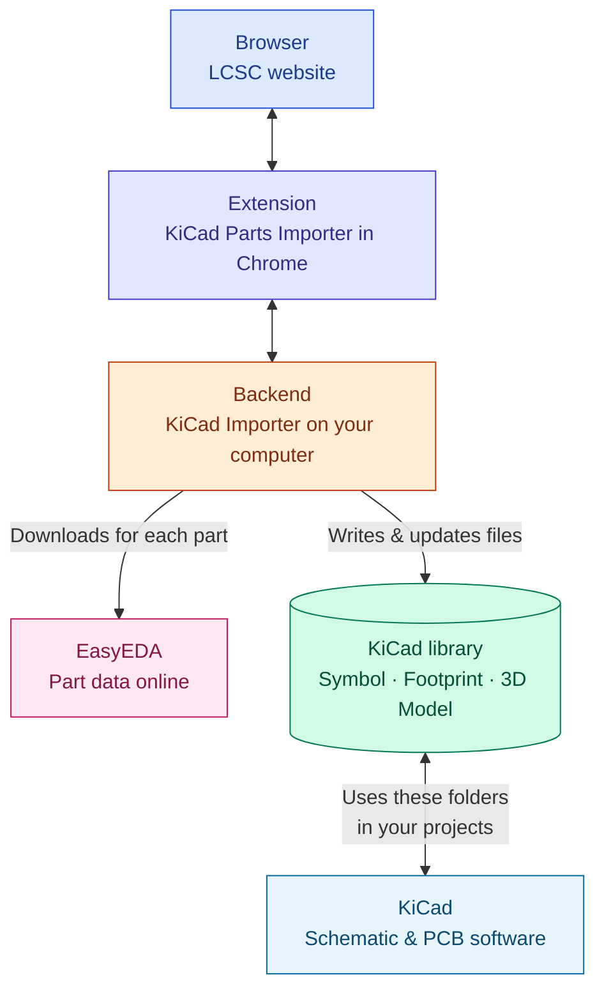

# KiCad Parts Importer

**Version 2.0.0** · Chrome extension for [LCSC](https://www.lcsc.com/) with a **local backend** — import symbols, footprints, and 3D models into KiCad libraries using EasyEDA-sourced data, with optional **custom KiCad symbol templates**.

> [!WARNING]
> EasyEDA source data can contain errors. **Verify pins and footprints** before using converted parts in production.

  

## Features

What you get, in everyday terms:

- **Import from LCSC** — On a part’s product page, choose **EasyEDA** (standard conversion) or **Template** (your own symbol shape). Progress shows on the page until the part is saved.
- **Works in Chrome** — The extension adds buttons and dialogs on LCSC and a **popup** for libraries and rules. Optional **PDF datasheet** viewer for LCSC links.
- **Your KiCad libraries** — New **Symbol**, **Footprint**, and **3D Model** files go into folders you pick. Open **KiCad** and use those libraries like any other.
- **Smarter imports** — Popup **Categories** tab matches LCSC product paths so **Value** and pin visibility follow your rules. **Template** mode can ask you to match pins to footprint pads when needed.

---

## How it works

**Browser → extension → backend (on your PC) → KiCad library folders → KiCad.** The backend also pulls each part’s data from **EasyEDA** (LCSC’s design source).

| Step | In plain terms |
| --- | --- |
| **Browser (LCSC)** | You browse and search parts on the LCSC site in Chrome. |
| **Extension** | Adds **Download** actions and dialogs on LCSC, and a **popup** to pick libraries and category rules. |
| **Backend** | The **KiCad Importer** program on your PC: it converts each part and saves files. It talks to the extension while you import. |
| **EasyEDA** | LCSC parts are backed by **EasyEDA** data; the backend **downloads** symbol, footprint, and 3D data for the component you chose. |
| **KiCad library** | Folders on disk for **Symbol**, **Footprint**, and **3D Model**—where the backend writes, and where you point KiCad’s library tables. |
| **KiCad** | The **KiCad** application (schematic & board editors). It **loads** symbols and footprints from your library paths so you can place imported parts on a design. |

**KiCad version:** Imports use modern library files (`.kicad_sym`, `.kicad_mod`, etc.). Day-to-day testing targets **KiCad 9.x**; the same formats generally work with **KiCad 6+**.

## Contents

- [Features](#features)
- [How it works](#how-it-works)
- [Getting started](#getting-started)
- [Troubleshooting: Windows blocks the backend](#troubleshooting-windows-blocks-the-backend)
- [Using the popup and LCSC dialogs](#using-the-popup-and-lcsc-dialogs)
- [Import workflow on LCSC](#import-workflow-on-lcsc)
- [Templates & metadata](#templates--metadata)
  - [What templates are for](#what-templates-are-for)
  - [Supplying templates](#supplying-templates)
  - [Merge behavior](#merge-behavior)
  - [Metadata and symbol properties](#metadata-and-symbol-properties)
  - [Pin numbers (check before import)](#pin-numbers-check-before-import)
  - [Template list hover preview](#template-list-hover-preview-limitations)
- [Screenshots](#screenshots)
- [Credits & license](#credits--license)
- [Changelog](#changelog)
- [For developers](#for-developers)

## Getting started

### Prerequisites

- **Google Chrome** (or a Chromium-based browser that supports unpacked extensions).
- **Local backend** running on your machine — required for any import. Use a [release binary](../../releases) from this project, or run the Python server yourself if you work from the source tree.

### 1. Install the extension

- **Chrome Web Store:** [KiCad Parts Importer](https://chromewebstore.google.com/detail/ojkpgmndjlkghmaccanfophkcngdkpmi)  
- **From source:** open `chrome://extensions` → enable **Developer mode** → **Load unpacked** → select the **`chrome_extension/`** folder. After code changes, reload the extension and refresh LCSC tabs. (Module loading details: [For developers](#for-developers).)

### 2. Install and run the backend

From **Releases**, use the build for your OS (macOS/Linux/Windows). Examples:

- **macOS / Linux:** `chmod +x "./<version>-KiCad Parts Importer-<OS>"` then run the binary.  
- **macOS Gatekeeper:** `xattr -dr com.apple.quarantine "./<version>-KiCad Parts Importer-Mac"`  
- **Windows:** run `"<version>-KiCad Parts Importer-Windows.exe"`

If you run the backend **from source**, install the project’s Python dependencies, start `python run_server.py`, and use the port printed in the terminal (often **8087**) in the extension’s **API base URL**.

### Troubleshooting: Windows blocks the backend

Release builds are **PyInstaller** executables. They are **not Authenticode-signed** (signing requires a paid certificate and a separate release step). That is normal for many open-source projects, but Windows may still treat the file as **unfamiliar** or **not trusted** until you allow it—or until the project publishes **signed** binaries in the future.

**Why you might see warnings or blocks**

| Situation | What it means |
| --- | --- |
| **Downloaded file** | Browsers mark downloads with a “from the internet” flag. **Unblock** (below) removes that flag. |
| **SmartScreen** (“Windows protected your PC”) | Microsoft does not yet **trust the publisher** (no commercial signature + low download history). |
| **Smart App Control** (common on **Windows 11**) | Can **block unsigned** apps by policy. |
| **`Application Control policy has blocked this file`** (e.g. in PowerShell) | A **stricter policy** is active: **Smart App Control**, **WDAC**, **AppLocker**, or a **managed** (work/school) PC. Only an **administrator** (or your **IT** department) can allow the app, unless you change the policy on a **personal** PC you control. |

**What to try (in order)**

1. **Unblock (Properties)** — Right‑click the `.exe` → **Properties** → **General**. If you see **Security: This file came from another computer…** and a checkbox **Unblock**, enable it → **Apply** → **OK**. Then run the executable again.  
   This only clears the **download zone** marker; it does not replace SmartScreen or Smart App Control.

2. **SmartScreen** — If you get the blue **Windows protected your PC** screen: click **More info** → **Run anyway** (only if you trust this GitHub project’s release asset).

3. **Smart App Control (Windows 11)** — **Settings** → **Privacy & security** → **Windows Security** → **App & browser control** → **Smart App Control**.  
   If it is **On**, try **Off** or **Evaluation** (if your edition allows it), then run the `.exe` again. Re‑enable stricter settings afterward if you prefer.

4. **Managed PC / “Application Control”** — If the message explicitly says an **Application Control policy** blocked the file, your device may be **organization-managed** or running **WDAC/AppLocker**. **Unblock** and SmartScreen steps may not be enough. Use a **privately owned** test machine, or ask **IT** to allowlist the binary—or wait for a future **signed** Windows release from this project.

**Longer term:** Publishing a **code-signed** Windows binary improves trust with SmartScreen and Smart App Control but does not automatically bypass corporate lockdown policies.

### 3. Point the extension at the backend

1. Open the extension **popup** → **Settings** tab.  
2. Set **API base URL** to match the server (e.g. `http://localhost:8087`).  
3. Click **Test** to confirm the backend is reachable.  
4. The header should show the backend as connected; if not, check firewalls or anything blocking the extension from reaching `localhost`.

### 4. Add or select a KiCad library

1. Open the **Library** tab.  
2. Use **Add** to **create** a new library folder layout or **Import library** to register an existing `.kicad_sym`.  
3. **Activate** the library that should receive imports. Only one library is active at a time.

### 5. Import a part

1. Open an LCSC **product detail** page (`/product-detail/...`).  
2. Use **Download / EasyEDA** for the default LCSC-derived symbol, or **Download / Template** if you use template libraries (see [Templates & metadata](#templates--metadata)).  
3. Wait for the job to finish; the part appears under your active library’s paths.

**List pages** may show a compact download control; the full **Template** choice is on product pages.

## Using the popup and LCSC dialogs

Use the **extension popup** for libraries and rules, and **LCSC product pages** to run imports. The **Categories** tab maps LCSC product paths to **Value** and pin visibility; on-page LCSC tables supply parameter text when you import.

### Popup: Categories · Library · Settings

The popup uses **three tabs**, in this order:

| Tab | Role |
| --- | --- |
| **Categories** | Rows keyed by LCSC **category path**; per row: **Value Param**, **hide pin numbers/names**. Used when resolving imports. |
| **Library** | KiCad libraries on disk: **activate** one for output, **Add** / **Import**, **Template** switch per library, search and asset counts. |
| **Settings** | **Backend** URL and **Test**, popup **theme**, and **import defaults** (overwrites, debug logging, project-relative 3D path defaults). |

---

### Categories tab

Each **row** is one saved rule. Expand a row to edit details; changes save as you edit.

| Field | Purpose |
| --- | --- |
| **Category name** | Lookup key: LCSC breadcrumb path with slashes, e.g. `Passives/Resistors/SMD` (normalized when saved, same rules as the page path). |
| **Value Param** | **Exact** LCSC parameter **column title** for the KiCad symbol **Value**. If missing or empty on a part, you get a **Value parameter not found** dialog (default Value, reconfigure, or cancel). |
| **Hide pin numbers / Hide pin names** | Passed to conversion when this row wins the match below. |

**Matching:** **Deepest-prefix** — among all rows, the **longest** key that **equals** the product path or is a **strict prefix** (`key + "/"`) wins. There is no separate short-name or second-segment shortcut. A single segment like **`Resistors`** only matches paths that are exactly `Resistors` or start with `Resistors/`; nested LCSC categories usually need a longer prefix (e.g. **`Passives/Resistors`**, included by default on new installs).

**Default row:** New installs include **`Passives/Resistors`** so typical resistor paths match by prefix; adjust or add rows if your LCSC locale uses a different tree.

**Templates:** The **template symbol** is chosen on the **LCSC page** (**Download → Template**), not in this tab. Mark **template libraries** on the **Library** tab.

---

### Library tab

| Item | Purpose |
| --- | --- |
| **Active library** | All imports write into this library’s on-disk paths. |
| **Add / Create** | Name, base folder, and whether to create `.kicad_sym`, `.pretty`, `.3dshapes`, plus optional **project-relative 3D** paths (`${KIPRJMOD}` + **3D base path**). |
| **Import library** | Register an existing `.kicad_sym` with the backend. |
| **Template** switch | Marks a template library so its symbols appear in the LCSC Template picker. How merging and metadata work, and how to verify pin numbering on the LCSC page, are described under [Templates & metadata](#templates--metadata). |
| **Search / counts** | Filter the list; summary shows symbol / footprint / 3D counts. |

**3D paths:** Each library stores project-relative options from **Create** / import. On import, the **active library** is used first; if its **3D base path** is empty, the extension falls back to **Settings → Import defaults → Project relative 3D paths**. Changing defaults pre-fills **Add library** but does not rewrite older libraries.

---

### Settings tab

#### Backend & appearance

| Item | Purpose |
| --- | --- |
| **API base URL** | Address of the KiCad Importer program on your PC (must match where the backend listens). |
| **Test** | Verifies reachability (not a full conversion). |
| **Light / Dark** | Theme for the **popup only** (not LCSC). |

#### Import defaults

These apply to **product-page imports** unless a dialog offers a one-off choice (e.g. overwrite).

| Item | Purpose |
| --- | --- |
| **Overwrite footprints & symbols** | Replace existing symbol/footprint files without asking each time when appropriate. |
| **Overwrite 3D models** | Same for 3D files. |
| **Project relative 3D paths** | Default for new libraries and fallback path segment for `${KIPRJMOD}`-based model references. |
| **Enable debug logging** | Optional: extra detail in the extension’s logs (see **For developers** to open the service worker console). |

---

### Category and value dialogs on LCSC

- **New category:** No saved **Categories** row matches this product’s path — skip once, save for the path shown, continue without saving, or cancel. **Hide pin numbers** and **Hide pin names** start **off** (pins visible); turn them on in the dialog if you want them hidden for that category.  
- **No parameters:** Attribute tables could not be read — default Value or add a **Categories** row.  
- **Value mismatch:** The saved **Value Param** is missing or empty on this page — default, reconfigure in **Categories**, or cancel.

### Where your settings live

**Categories**, **Library** list, and **Settings** are saved in **Chrome** (extension storage). When the backend is connected, the extension keeps the backend aligned so imports use the same choices.

## Import workflow on LCSC

When you start a download on a **product page**, the extension roughly:

1. Confirms the **backend** is connected.  
2. If the part **already exists** and overwrites are off, may ask **Overwrite?** (once, permanently, or cancel).  
3. Resolves **category** and **Value** using the **Categories** tab rules and on-page tables (dialogs if needed).  
4. **Template** only: checks pin count vs EasyEDA, then a **pin ↔ pad** screen (previews + table). **Back** / **Cancel** / **Confirm** to finish or return to the template list; you can continue with a warning if counts differ. **EasyEDA** skips this step.  
5. Submits a **job** and shows **progress** on the page until success or error.

Cancelling a blocking dialog returns you to a normal button state; **in library** state is refreshed where applicable.

## Templates & metadata

### What templates are for

You draw a KiCad symbol once (outline, pin positions, property placement, fonts) and reuse that layout for many LCSC parts. Each import still pulls fresh part data from LCSC/EasyEDA; the template is the starting geometry and style, not a frozen copy of one component.

### Supplying templates

- Put `Templates.kicad_sym` next to your active symbol library, or mark any library as a template library in the extension popup and keep template symbols there.
- Names such as `Template_Resistor` or `Template_Capacitor` are typical. The Template picker on the LCSC product page lists symbol names the backend finds in those libraries.

### Merge behavior

On import, the merger keeps your drawing and property layout where it can, overwrites field values with new LCSC data, and makes the **symbol** pin list match EasyEDA for that exact part:

- A pin number exists in both template and EasyEDA → your template keeps that pin’s position and orientation.
- Number exists only in EasyEDA → a new pin is added (often at the origin until you move it).
- Number exists only in the template → that pin is removed.

Any difference between your numbering and EasyEDA’s therefore shows up as extra editing work on the symbol, even though the merged pin set is consistent with EasyEDA’s model for that component.

The template does **not** describe how schematic pins attach to the **footprint**. Pad shapes, positions, and pad numbers always come from EasyEDA for the part you import. You cannot infer package numbering from the template alone, and datasheets or vendor drawings sometimes use a pad order that feels “wrong” or confusing next to your symbol. If symbol pin numbers and footprint pad numbers are misaligned with what you expected, nets can look correct on the schematic but connect to the wrong pads—so it is worth re-checking the mapping after import (schematic, footprint editor, and datasheet) even when the merger ran cleanly.

### Metadata and symbol properties

The extension reads LCSC product data—datasheet link, description, manufacturer, package, and the attribute tables—and writes them into KiCad symbol properties. A small mapping table rewrites common LCSC column titles into shorter, stable names (for example power, tolerance, voltage ratings) so properties stay consistent across parts.

### Pin numbers (check before import)

> [!WARNING]
> Use real numeric pin numbers in KiCad (1, 2, 3, …) that match EasyEDA for the devices you care about, and put text like G, D, or S in the pin name field, not in the number field. On the LCSC product page, use the pinout diagram or package illustration, or open the EasyEDA schematic view for that component, and confirm each pad matches the digit you used in the template. If anything disagrees, fix the template before importing; otherwise the merger will add or move pins and you will need to clean up the symbol by hand.

### Template list hover preview (limitations)

While the **Template** picker is open, hovering or focusing a row requests a **small SVG** of that template symbol from the backend. It is a **subset** of KiCad graphics (no `extends` inheritance, limited primitives); huge symbols may be capped. It is meant as a quick visual hint, not a full editor preview.

## Screenshots

The picture at the top of this page is the **Chrome Web Store** style card (`img/store_images/store-card.jpg`). Other files under `img/` are not shown here because they no longer match the current extension UI.

## Credits & license

Based on [easyeda2kicad](https://github.com/uPesy/easyeda2kicad.py) by uPesy.

### License

> [!NOTE]
> This repository includes **AGPL-3.0** code from the upstream project; that license still applies to those parts. See `LICENSE`.

## Changelog

### [v2.0.0](https://github.com/theautomatist/KiCad-Parts-Importer/releases/tag/v2.0.0)

Major release since **[v1.0.1](https://github.com/theautomatist/KiCad-Parts-Importer/releases/tag/v1.0.1)** (extension manifest **2.0.0**). Full diff: [v1.0.1…v2.0.0](https://github.com/theautomatist/KiCad-Parts-Importer/compare/v1.0.1...v2.0.0).

### Extension

- **WebSocket-only** control plane with the local backend (`/ws/extension`, JSON-RPC + task push); no separate REST surface for app logic.
- **Modular MV3 front end:** ES-module **content script** (`inject.js` → `main.js`), shared **WebSocket RPC** client and constants, background organized around runtime message handlers and job/WebSocket sections.
- **Popup:** redesigned **Categories**, **Library**, and **Settings**; theme tokens; library create/import and category table UX.
- **LCSC product pages:** shadow-DOM download controls, **EasyEDA** vs **Template** flows, progress and **confetti** on success; category / value dialogs with full breadcrumb path.
- **Categories:** normalized paths and **deepest-prefix** resolution only (legacy second-segment matching removed); shared **`categoryPath.js`** across service worker, content script, and popup; default starter row **`Passives/Resistors`** for typical LCSC resistor paths.
- **Templates:** per-library template mode, LCSC template picker with **hover SVG preview**, **pin-count check** vs EasyEDA, **pin ↔ pad assignment** modal (previews + remap sent as `template_pin_map`), optional continue when counts differ.
- **PDF:** local **PDF viewer** page using vendored **pdf.js** (ESM) for LCSC datasheets where useful.
- **Other:** backend **connection hint** when offline; **`notifications`** permission removed.

### Backend & conversion

- **Template symbols:** merge LCSC metadata into user templates; **pin table** synced with EasyEDA (add/remove pins); optional **`force_template`** and template **pin-check** on the API.
- **LCSC → KiCad:** richer metadata as symbol properties; EasyEDA API **retries**, timeouts, and calmer logging for missing 3D models; **KiCad 9.x** as the primary target (modern ``.kicad_sym`` / ``.kicad_mod``).
- **Previews & geometry:** **symbol SVG** preview (including pin label visibility aligned with KiCad), **footprint SVG** preview from the KiCad footprint model, **pin remap** support, **pad numbering** normalized for KiCad, footprint export fixes (pads, THT, 3D placement with Z rotation), safer **SVGNODE** parsing for 3D assets.
- **Service layer:** shared LCSC **footprint / preview bundle** for conversion and UI flows.

### Tests

- Template **merger** unit tests; symbol **preview** tests (pin label visibility).

### Docs & tooling

- README **How it works** diagram, import workflow, popup overview, and extension refactor **playbook**; **WebSocket RPC contract** (`chrome_extension/EXTENSION_WS_RPC_CONTRACT.md`).
- **GitHub Actions:** manual **CI** workflow (Python tests + extension checks); **build/release** workflow on version tags; workflows use **Node 24**–native action versions (`actions/checkout`, `setup-python`, `setup-node`, upload/download artifacts, `action-gh-release`).

## For developers

- **Extension ↔ backend** — One **WebSocket** to **`/ws/extension`** (same host and port as the API base URL, e.g. `http://localhost:8087` → `ws://localhost:8087/ws/extension`). **JSON-RPC–style** methods plus server push for jobs and state. No separate REST API for that control plane. Full method list: [`chrome_extension/EXTENSION_WS_RPC_CONTRACT.md`](chrome_extension/EXTENSION_WS_RPC_CONTRACT.md).
- **Chrome extension layout** — Unpacked root is **`chrome_extension/`**. MV3 **service worker** (`background.js`) holds the socket; LCSC UI lives under **`src/content/`**. Entry: **`inject.js`** loads **`main.js`** as a module (so static `import` works reliably); after edits, reload the extension.
- **Backend** — Python package **`easyeda2kicad/`**; run **`python run_server.py`** from the repo. EasyEDA is called over **HTTPS** from the server. There is no desktop window when running from source, so there is no in-app icon in that mode.
- **Packaged server (PyInstaller)** — CI and release builds use the high-resolution store master **`img/store_images/icon.png`** (downscaled per size for ICO/ICNS). The Chrome toolbar still uses **`chrome_extension/icon.png`**. Windows: generated **`app.ico`** embeds **16–512 px** PNG layers (512×512 for large Explorer views); **`build/pyinstaller/app_icon_512.png`** is also written as a flat **512×512** asset. Stepped downscaling + light unsharp on small sizes keeps taskbar icons crisp. macOS: **`app.icns`** (`packaging/pyinstaller/build_macos_icns.sh`, `sips` + `iconutil`). Linux onefile binaries do not get a custom executable icon from PyInstaller. Example (Windows): `pip install pyinstaller pillow` → `python packaging/pyinstaller/build_windows_ico.py` → `pyinstaller --onefile --icon build/pyinstaller/app.ico --name "KiCad Parts Importer" run_server.py`.
