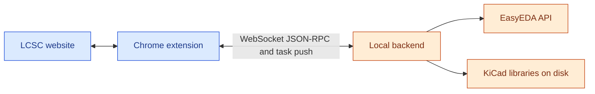

# KiCad Parts Importer

**Version 2.0.0** · Chrome extension for [LCSC](https://www.lcsc.com/) with a **local backend** — import symbols, footprints, and 3D models into KiCad libraries using EasyEDA-sourced data, with optional **custom KiCad symbol templates**.

> [!WARNING]
> EasyEDA source data can contain errors. **Verify pins and footprints** before using converted parts in production.

  

## Architecture & data exchange

| Path | What flows |
| --- | --- |
| **LCSC ↔ extension** | The **content script** reads product pages and renders download UI; user actions trigger messages to the **service worker**. |
| **Extension ↔ backend** | The **service worker** opens one **WebSocket** to **`/ws/extension`** (`ws://` or `wss://`, same **host and port** as **API base URL**, e.g. `http://localhost:8087` → `ws://localhost:8087/ws/extension`). Requests use **JSON-RPC**-style methods (enqueue jobs, health, library/fs helpers, template pin-check, etc.). The backend **pushes** **`task_update`** (and related) messages so job progress reaches the UI **without polling**. |
| **Backend ↔ EasyEDA / disk** | The Python server fetches EasyEDA CAD data and writes symbols, footprints, and 3D files into the library paths you configure. |

There is **no separate HTTP REST API** for application logic: extension and backend coordinate **only** on that WebSocket (aside from the browser loading normal LCSC pages).

## Overview

- **Extension** (Chrome, Manifest V3) adds controls on LCSC and a **popup** with three tabs — **Categories**, **Library**, and **Settings** — for import rules, KiCad libraries, and backend/defaults.
- **Backend** (Python, same repo) performs conversion and talks to EasyEDA; it stores files under your chosen library folders.
- Details of the wire protocol are summarized in [Architecture & data exchange](#architecture--data-exchange) above.

## Contents

- [Architecture & data exchange](#architecture--data-exchange)
- [Getting started](#getting-started)
- [Understanding settings & parameters](#understanding-settings--parameters)
- [Import workflow on LCSC](#import-workflow-on-lcsc)
- [Templates & metadata](#templates--metadata)
  - [What templates are for](#what-templates-are-for)
  - [Supplying templates](#supplying-templates)
  - [Merge behavior](#merge-behavior)
  - [Metadata and symbol properties](#metadata-and-symbol-properties)
  - [Pin numbers (check before import)](#pin-numbers-check-before-import)
  - [Possible future enhancement (not scheduled)](#possible-future-enhancement-not-scheduled)
- [Screenshots](#screenshots)
- [Credits & license](#credits--license)
- [Changelog](#changelog)

## Getting started

### Prerequisites

- **Google Chrome** (or a Chromium-based browser that supports unpacked extensions).
- **Local backend** running on your machine — required for any import. Use a [release binary](../../releases) from this project, or run the Python server yourself if you work from the source tree.

### 1. Install the extension

- **Chrome Web Store:** [KiCad Parts Importer](https://chromewebstore.google.com/detail/ojkpgmndjlkghmaccanfophkcngdkpmi)  
- **From source:** open `chrome://extensions` → enable **Developer mode** → **Load unpacked** → select the `chrome_extension/` folder in this repository.

### 2. Install and run the backend

From **Releases**, use the build for your OS (macOS/Linux/Windows). Examples:

- **macOS / Linux:** `chmod +x "./<version>-KiCad Parts Importer-<OS>"` then run the binary.  
- **macOS Gatekeeper:** `xattr -dr com.apple.quarantine "./<version>-KiCad Parts Importer-Mac"`  
- **Windows:** run `"<version>-KiCad Parts Importer-Windows.exe"`

If you run the backend **from source**, install the project’s Python dependencies, start `python run_server.py`, and use the port printed in the terminal (often **8087**) in the extension’s **API base URL**.

### 3. Point the extension at the backend

1. Open the extension **popup** → **Settings** tab.  
2. Set **API base URL** to match the server (e.g. `http://localhost:8087`).  
3. Click **Test** to confirm the backend is reachable.  
4. The header should show the backend as connected; if not, check firewalls, proxies, or software blocking **WebSockets** to `localhost`.

### 4. Add or select a KiCad library

1. Open the **Library** tab.  
2. Use **Add** to **create** a new library folder layout or **Import library** to register an existing `.kicad_sym`.  
3. **Activate** the library that should receive imports. Only one library is active at a time.

### 5. Import a part

1. Open an LCSC **product detail** page (`/product-detail/...`).  
2. Use **Download / EasyEDA** for the default LCSC-derived symbol, or **Download / Template** if you use template libraries (see [Templates & metadata](#templates--metadata)).  
3. Wait for the job to finish; the part appears under your active library’s paths.

**List pages** may show a compact download control; the full **Template** choice is on product pages.

## Understanding settings & parameters

Two surfaces matter: the **extension popup** (three tabs below) and **LCSC product pages** (where you run imports and sometimes see category/value dialogs). LCSC table columns feed KiCad fields; the **Categories** tab decides how **Value** and pin visibility apply per product category.

### Popup: Categories · Library · Settings

The popup uses **three tabs**, in this order:

| Tab | Role |
| --- | --- |
| **Categories** | Rows keyed by LCSC **category path**; per row: **Value Param**, **hide pin numbers/names**. Used when resolving imports. |
| **Library** | KiCad libraries on disk: **activate** one for output, **Add** / **Import**, **Template** switch per library, search and asset counts. |
| **Settings** | **Backend** URL and **Test**, popup **theme**, and **import defaults** (overwrites, debug logging, project-relative 3D path defaults). |

---

### Categories tab

Each **row** is one saved rule. Expand a row to edit details; changes save as you edit.

| Field | Purpose |
| --- | --- |
| **Category name** | Lookup key: LCSC breadcrumb path with slashes, e.g. `Passives/Resistors/SMD` (normalized when saved, same rules as the page path). |
| **Value Param** | **Exact** LCSC parameter **column title** for the KiCad symbol **Value**. If missing or empty on a part, you get a **Value parameter not found** dialog (default Value, reconfigure, or cancel). |
| **Hide pin numbers / Hide pin names** | Passed to conversion when this row wins the match below. |

**Matching:** **Deepest-prefix** — among all rows, the **longest** key that **equals** the product path or is a **strict prefix** (`key + "/"`) wins. There is no separate short-name or second-segment shortcut.

**Default row:** New installs include **`Passives/Resistors`** so typical resistor paths match by prefix; adjust or add rows if your LCSC locale uses a different tree.

**Templates:** The **template symbol** is chosen on the **LCSC page** (**Download → Template**), not in this tab. Mark **template libraries** on the **Library** tab.

---

### Library tab

| Item | Purpose |
| --- | --- |
| **Active library** | All imports write into this library’s on-disk paths. |
| **Add / Create** | Name, base folder, and whether to create `.kicad_sym`, `.pretty`, `.3dshapes`, plus optional **project-relative 3D** paths (`${KIPRJMOD}` + **3D base path**). |
| **Import library** | Register an existing `.kicad_sym` with the backend. |
| **Template** switch | Marks a template library so its symbols appear in the LCSC Template picker. How merging and metadata work, and how to verify pin numbering on the LCSC page, are described under [Templates & metadata](#templates--metadata). |
| **Search / counts** | Filter the list; summary shows symbol / footprint / 3D counts. |

**3D paths:** Each library stores project-relative options from **Create** / import. On import, the **active library** is used first; if its **3D base path** is empty, the extension falls back to **Settings → Import defaults → Project relative 3D paths**. Changing defaults pre-fills **Add library** but does not rewrite older libraries.

---

### Settings tab

#### Backend & appearance

| Item | Purpose |
| --- | --- |
| **API base URL** | Host and port of the conversion server; drives WebSocket and health checks. |
| **Test** | Verifies reachability (not a full conversion). |
| **Light / Dark** | Theme for the **popup only** (not LCSC). |

#### Import defaults

These apply to **product-page imports** unless a dialog offers a one-off choice (e.g. overwrite).

| Item | Purpose |
| --- | --- |
| **Overwrite footprints & symbols** | Replace existing symbol/footprint files without asking each time when appropriate. |
| **Overwrite 3D models** | Same for 3D files. |
| **Project relative 3D paths** | Default for new libraries and fallback path segment for `${KIPRJMOD}`-based model references. |
| **Enable debug logging** | Optional: more detailed extension logs for troubleshooting (extension/service worker console). |

---

### Category and value dialogs on LCSC

- **New category:** No saved **Categories** row matches this product’s path — skip once, save for the path shown, continue without saving, or cancel.  
- **No parameters:** Attribute tables could not be read — default Value or add a **Categories** row.  
- **Value mismatch:** The saved **Value Param** is missing or empty on this page — default, reconfigure in **Categories**, or cancel.

### Where configuration is stored

**Categories** rows, **Library** list, **Settings** (URL, toggles, theme, import defaults), and related state live in **Chrome extension storage** and the **service worker**. When the backend is connected, the extension keeps this in sync so conversions use the same configuration.

## Import workflow on LCSC

When you start a download on a **product page**, the extension roughly:

1. Confirms the **backend** is connected.  
2. If the part **already exists** and overwrites are off, may ask **Overwrite?** (once, permanently, or cancel).  
3. Resolves **category** and **Value** using the **Categories** tab rules and on-page tables (dialogs if needed).  
4. For **Template**, may run a **pin-count check** against EasyEDA; you can continue with constraints or fall back to EasyEDA.  
5. Submits a **job** and shows **progress** on the page until success or error.

Cancelling a blocking dialog returns you to a normal button state; **in library** state is refreshed where applicable.

## Templates & metadata

### What templates are for

You draw a KiCad symbol once (outline, pin positions, property placement, fonts) and reuse that layout for many LCSC parts. Each import still pulls fresh part data from LCSC/EasyEDA; the template is the starting geometry and style, not a frozen copy of one component.

### Supplying templates

- Put `Templates.kicad_sym` next to your active symbol library, or mark any library as a template library in the extension popup and keep template symbols there.
- Names such as `Template_Resistor` or `Template_Capacitor` are typical. The Template picker on the LCSC product page lists symbol names the backend finds in those libraries.

### Merge behavior

On import, the merger keeps your drawing and property layout where it can, overwrites field values with new LCSC data, and makes the **symbol** pin list match EasyEDA for that exact part:

- A pin number exists in both template and EasyEDA → your template keeps that pin’s position and orientation.
- Number exists only in EasyEDA → a new pin is added (often at the origin until you move it).
- Number exists only in the template → that pin is removed.

Any difference between your numbering and EasyEDA’s therefore shows up as extra editing work on the symbol, even though the merged pin set is consistent with EasyEDA’s model for that component.

The template does **not** describe how schematic pins attach to the **footprint**. Pad shapes, positions, and pad numbers always come from EasyEDA for the part you import. You cannot infer package numbering from the template alone, and datasheets or vendor drawings sometimes use a pad order that feels “wrong” or confusing next to your symbol. If symbol pin numbers and footprint pad numbers are misaligned with what you expected, nets can look correct on the schematic but connect to the wrong pads—so it is worth re-checking the mapping after import (schematic, footprint editor, and datasheet) even when the merger ran cleanly.

### Possible future enhancement (not scheduled)

> [!NOTE]
> This is an idea only: there is **no** release date and **no** entry on a committed roadmap. A later version of the extension could, in principle, add a step during the LCSC download flow that walks through symbol pin ↔ footprint pad mapping and asks you to confirm before files are written, so the assignment is unambiguous and less follow-up work is needed. Nothing like that ships today; verification remains manual.

### Metadata and symbol properties

The extension reads LCSC product data—datasheet link, description, manufacturer, package, and the attribute tables—and writes them into KiCad symbol properties. A small mapping table rewrites common LCSC column titles into shorter, stable names (for example power, tolerance, voltage ratings) so properties stay consistent across parts.

### Pin numbers (check before import)

> [!WARNING]
> Use real numeric pin numbers in KiCad (1, 2, 3, …) that match EasyEDA for the devices you care about, and put text like G, D, or S in the pin name field, not in the number field. On the LCSC product page, use the pinout diagram or package illustration, or open the EasyEDA schematic view for that component, and confirm each pad matches the digit you used in the template. If anything disagrees, fix the template before importing; otherwise the merger will add or move pins and you will need to clean up the symbol by hand.

## Screenshots

The picture at the top of this page is the **Chrome Web Store** style card (`img/store_images/store-card.jpg`). Other files under `img/` are not shown here because they no longer match the current extension UI.

## Credits

Based on [easyeda2kicad](https://github.com/uPesy/easyeda2kicad.py) by uPesy.

## License

> [!NOTE]
> This repository includes **AGPL-3.0** code from the upstream project; that license still applies to those parts. See `LICENSE`.

## Changelog

Summary of changes **since [v1.0.1](https://github.com/theautomatist/KiCad-Parts-Importer/releases/tag/v1.0.1)** (current development tree; extension **manifest 2.0.0**).

### Extension

- **WebSocket-only** control plane with the local backend (`/ws/extension`, JSON-RPC + task push); no separate REST surface for app logic.
- **Popup:** redesigned **Categories**, **Library**, and **Settings**; theme tokens; library create/import and category table UX.
- **LCSC product pages:** Shadow DOM download controls, **EasyEDA** vs **Template** flows, progress and **confetti** on success; category / value dialogs with full breadcrumb path.
- **Categories:** normalized paths and **deepest-prefix** resolution only (legacy second-segment matching removed); shared **`categoryPath.js`** for path normalization across service worker, content script, and popup; default starter row **`Passives/Resistors`** so prefix matching works on typical LCSC resistor paths.
- **Templates:** per-library template mode, LCSC template picker, **pin-count check** vs EasyEDA with optional continue.
- **Other:** backend **connection hint** when offline; **`notifications`** permission removed.

### Backend & conversion

- **Template symbols:** merge LCSC metadata into user templates; **pin table** synced with EasyEDA (add/remove pins); optional **`force_template`** and **`/templates/pin-check`**.
- **LCSC → KiCad:** richer metadata as symbol properties; EasyEDA API **retries**, timeouts, and calmer logging for missing 3D models.
- **Tests:** template merger unit tests.

### Docs & tooling

- README **architecture** diagram (mermaid), import workflow, settings overview; developer **playbook** and popup settings reference under `docs/`.
- **GitHub Actions:** manual workflow for releases/CI.

*If you still have a single-segment row like `Resistors`, it only matches paths that are exactly `Resistors` or start with `Resistors/`. For nested LCSC paths, use a prefix such as `Passives/Resistors` (the default for new installs).*
