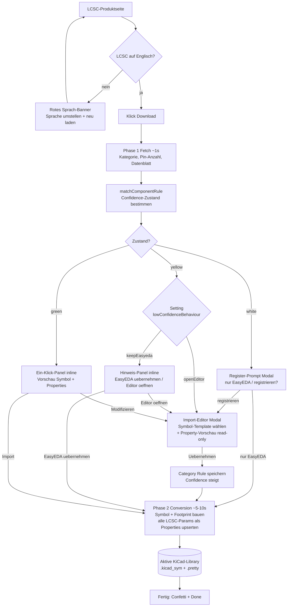

# Demo-Video-Drehbuch — KiCad Parts Importer V3

> Aufnahme-Leitfaden für das V3-Demo-Video. Reihenfolge so wählen, dass die
> Dramaturgie von „neues, unbekanntes Teil" zu „Ein-Klick-Magie" aufbaut.
> Technische Begriffe und Code-Identifier bleiben absichtlich im Original.

---

## 1. Kurz-Überblick (für die Video-Intro)

Der **KiCad Parts Importer V3** ist eine Chrome-Extension plus lokaler **Native
Host** (Python), die LCSC-/EasyEDA-Bauteile direkt in deine KiCad-Bibliotheken
importiert — ohne die LCSC-Seite zu verlassen. Statt jedes Mal Symbol, Footprint
und Metadaten von Hand zu verknüpfen, fährt V3 einen **Confidence-Zustandsautomaten**:
neue Teile fragen einmal nach (⚪), gleichartige Teile danach laufen mit **einem
Klick** durch (🟢). Eigene Template-Symbole können sich über eine `Category`-Property
**selbst beschreiben**, sodass passende LCSC-Teile automatisch erkannt werden —
ganz ohne manuelles Registrieren. Alle technischen Tabellen-Daten der LCSC-Seite
landen automatisch als Symbol-Properties.

---

## 2. Feature-Liste

- **LCSC-Import via Native Host** — Chrome startet bei Bedarf einen lokalen
  Python-Prozess (kein dauerhaft laufender Server). Der Import läuft in zwei
  Phasen: **Phase 1 Fetch** (~1 s, holt Kategorie, Pin-Anzahl, Datenblatt-URL)
  und **Phase 2 Conversion** (~5–10 s, baut Symbol + Footprint und schreibt in
  die aktive Library). Ein **Warm-Port** hält Python über die Session warm.

- **Confidence-Zustandsautomat** — jedes Teil bekommt einen Zustand:
  **⚪ neu/unbekannt** → aktiver Register-Prompt; **🟡 unsicher** → Hinweis oder
  Import-Editor (per Setting); **🟢 sicher** → **Ein-Klick-Import** (plus
  „Modifizieren" für den Sonderfall). Es gibt keinen stillen Hintergrund-Write
  und keinen Countdown — die Vorschau ist immer sichtbar.

- **Import-Editor als Modal-Overlay** — eine einzige wiederverwendbare Oberfläche
  für **Registrieren / Modifizieren / Low-Confidence**. ⚪ Register-Prompt und der
  Editor erscheinen als abgedunkeltes Modal; 🟢/🟡 bleiben inline unter der
  Produkt-Tabelle (Seitenfluss, kein Dialog).

- **Metadaten-Auto-Upsert** — **alle** technischen Parameter aus den LCSC-Tabellen
  werden beim Import automatisch als Symbol-Properties geschrieben (vorhandenes
  Feld → Wert ersetzt, fehlendes → ergänzt). Kein manuelles Label-Mapping;
  Stock/Preis/Menge filtert der Scraper raus. Der Import-Editor zeigt nur noch eine
  **read-only Property-Vorschau**.

- **Category-Property-Match (self-describing templates)** — trägt ein Template-Symbol
  eine KiCad-Property `Category` (z. B. `Resistors`), wird die LCSC-Kategorie
  automatisch dagegen gematcht. Ein **eindeutiger** Treffer gilt als
  selbst-registriert → **🟢 Ein-Klick ohne manuelles Registrieren**. Die Kategorie
  muss nicht tief sein: `Resistors` matcht `Resistors/Chip Resistor - Surface Mount`.
  Ein-Symbol-eine-Kategorie; eine bereits registrierte Regel gewinnt vor dem
  Auto-Match.

- **Lernschleife** — einmal **Registrieren** speichert eine Category Rule und hebt
  die Confidence. Beim nächsten gleichartigen Teil ist der Zustand sofort **🟢**.

- **Library-Management im Popup** — Library **anlegen** (`scaffoldLibrary`: legt
  `<name>.kicad_sym` + `.pretty`/`.3dshapes` an) oder bestehende **importieren**
  (`validateLibrary`). Datei-Picker mit **Allowed-Roots-Whitelist** (Documents,
  KiCad-Standardpfade; eigene Ordner explizit hinzufügbar). Picker-Buttons hängen
  am **Native-Host-Status**.

- **Sprach-Warnung** — steht LCSC nicht auf Englisch, erscheint ein **rotes Banner**
  unter der Produkt-Tabelle. Grund: der Scraper liest Werte in der Anzeigesprache —
  nicht-Englisch erzeugt gemischte/lokalisierte Metadaten **und** bricht das Matching
  (`Widerstände` matcht nie ein Template mit `Resistors`). Erkannt über `<html lang>`,
  Fallback über das Kategorie-Label; bei Unsicherheit bleibt das Banner aus (kein
  Fehlalarm).

---

## 3. Mermaid-Ablaufdiagramm (Import-Flow)



---

## 4. Aufnahme-Reihenfolge (Herzstück)

> Legende: **[Browser]** = Extension/LCSC-Seite/Popup · **[KiCad]** = im KiCad-Programm.
> Vor der Aufnahme: frische Test-Library anlegen, LCSC auf Englisch, Native Host
> einmal pingen (siehe Tipps unten).

### Akt 1 — Setup zeigen

1. **[Browser]** Chrome-Toolbar: Extension-Icon zeigen. Kurz erwähnen, dass der
   **Native Host** (lokaler Python-Prozess) von Chrome bei Bedarf gestartet wird.
2. **[Browser]** Popup öffnen → **Library-Tab**. Zustand „Native Host online" zeigen
   (Picker-Buttons sind aktiv, sobald der Host erreichbar ist).
3. **[Browser]** Über **Add/Create** eine **frische Test-Library** anlegen
   (`scaffoldLibrary` legt `.kicad_sym` + `.pretty`/`.3dshapes` an). Den Ordner-Picker
   und die Allowed-Roots zeigen. Diese Library als **aktiv** schalten.
4. **[Browser]** Eine eigene **Template-Library** mit eigenen Symbolen importieren
   (`validateLibrary`) und als **Template-Library** markieren (Schalter/Flag). Damit
   tauchen ihre Symbole im Symbol-Dropdown des Import-Editors auf.

### Akt 2 — Sprach-Warnung demonstrieren

5. **[Browser]** LCSC vorübergehend auf **Deutsch** stellen, eine Produktseite öffnen
   → **rotes Sprach-Banner** unter der Produkt-Tabelle zeigen. Kurz erklären: Werte
   würden sonst gemischt/lokalisiert importiert und das Matching bräche.
6. **[Browser]** LCSC zurück auf **Englisch** stellen, Seite neu laden → Banner ist weg.

### Akt 3 — Erstes neues Teil (⚪ → Registrieren)

7. **[Browser]** Eine LCSC-Produktseite eines **neuen** Bauteiltyps öffnen (z. B. ein
   Widerstand), für den noch **keine** Regel existiert. **Download** klicken.
8. **[Browser]** Phase 1 läuft kurz → **⚪ Register-Prompt** (Modal) erscheint:
   „Neues Bauteil — nur EasyEDA herunterladen ODER registrieren?". Auf **registrieren** klicken.
9. **[Browser]** **Import-Editor** (Modal) öffnet sich: die LCSC-Kategorie wird oben
   angezeigt, im **Symbol-Dropdown** das passende Template-Symbol aus der Template-Library
   wählen.
10. **[Browser]** Die **read-only Property-Vorschau** zeigen — alle technischen
    LCSC-Parameter, die als Symbol-Properties geschrieben werden („Eigenschaften, die
    ins Symbol übernommen werden (N)"). Betonen: **kein manuelles Mapping** mehr nötig.
11. **[Browser]** **Übernehmen** klicken → Category Rule wird gespeichert **und** der
    Import startet sofort für dieses Teil (Phase 2). Progress-Balken + „Done" + Confetti zeigen.

### Akt 4 — Ergebnis in KiCad prüfen

12. **[KiCad]** Symbol-Editor öffnen, die Test-Library wählen, das **importierte Symbol**
    öffnen. Zeigen: Geometrie stammt aus dem **Template**, und **alle Properties** (MPN,
    Manufacturer, technische Specs …) sind gefüllt.

### Akt 5 — Category-Property-Match vorbereiten

13. **[KiCad]** Dem Template-Symbol (oder einem zweiten Template-Symbol für eine andere
    Bauteilklasse) eine Property **`Category`** geben, z. B. `Category = "Resistors"`.
    Speichern. Kurz erklären: das Template **beschreibt sich jetzt selbst**.
14. **[Browser]** (optional, falls nötig) Popup kurz schließen/öffnen bzw. Seite neu laden,
    damit der Native Host die Template-Kategorien frisch einliest (`list_symbol_categories`).

### Akt 6 — Gleichartiges Teil (🟢 Ein-Klick + self-describing)

15. **[Browser]** Eine LCSC-Produktseite eines **gleichartigen** Teils öffnen
    (anderer Widerstand). **Download** klicken.
16. **[Browser]** Jetzt **🟢 Ein-Klick-Panel** (inline) statt Register-Prompt: Vorschau
    von Symbol-Quelle + Properties. Den Zustandswechsel betonen — entweder weil die
    Regel aus Akt 3 **gelernt** wurde, oder weil das **`Category`-Property** das Template
    automatisch matcht (self-describing).
17. **[Browser]** **Import** klicken → ein Klick, sofortiger Import, kein Bestätigen,
    kein Countdown. „Modifizieren" nur erwähnen (öffnet bei Bedarf den Editor).

### Akt 7 — Ergebnis verifizieren

18. **[KiCad]** Test-Library neu laden, das **zweite Symbol** öffnen → Template-Geometrie
    + gefüllte Properties. Abschluss: „neues Teil = ⚪ einmal registrieren, alle weiteren
    = 🟢 ein Klick".

---

## 5. Tipps für die Aufnahme

- **Frische Test-Library** anlegen (nicht die echte Arbeits-Library!), damit Vorher/Nachher
  klar sichtbar ist und nichts überschrieben wird.
- **LCSC vorher auf Englisch** stellen (außer im kurzen Sprach-Warnungs-Take). Sonst
  gemischte Metadaten + gebrochenes Matching.
- **Native Host vorher pingen** (Popup öffnen, Status „online" abwarten), damit Phase 1
  im Take sofort reagiert und Python warm ist.
- **Zwei Bauteile derselben Klasse** bereitlegen (z. B. zwei Widerstände): das erste für
  ⚪ Registrieren, das zweite für 🟢 Ein-Klick.
- Für den **Category-Property-Match-Take** das `Category`-Property **vor** der Aufnahme
  am Template setzen und einmal testen, dass der eindeutige Match wirklich 🟢 auslöst
  (mehrdeutige Matches fallen auf die Heuristik / 🟡 zurück).
- **DevTools-Konsole** auf der LCSC-Seite kann beim Debuggen helfen, sollte für die
  Aufnahme aber zu sein.
- KiCad-Symbol-Editor mit der Test-Library **vorab geöffnet** halten, damit der
  Schnitt zwischen Browser und KiCad flüssig bleibt (Library nach jedem Import neu laden).
```
