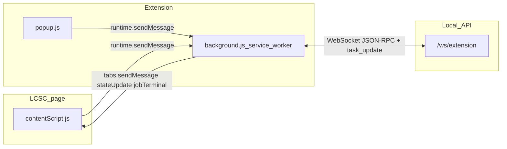

# Extension cleanup and refactor strategy

Campaign playbook for shrinking and simplifying the Chrome extension (`chrome_extension/`), unifying design tokens, and aligning popup vs in-page UI. Execute in **phases**; prefer small PRs.

**Approximate scale:** `background.js` ~1.9k lines, `contentScript.js` ~3.3k, `popup.js` ~1.6k, `popup.css` ~840.

## Architecture (extension ↔ backend)

- **Popup:** settings, library list, manual download form → `getState`, `updateSettings`, `submitJob`, FS RPCs, etc.
- **Content script:** product-page buttons → `quickDownload`, `checkComponentExists`, listens for `stateUpdate` / `jobTerminal`.
- **Background:** owns WebSocket to easyeda2kicad API, job state, `broadcastState` + `broadcastToLcscContentTabs`.

## Design token table (popup)

| Token | Usage | Notes |
|-------|--------|--------|
| `--surface-base` | Cards, list rows | Primary dark surface |
| `--surface-raised` | Card body | Slightly lifted |
| `--surface-border` | Default borders | Subtle |
| `--surface-border-strong` | Emphasis borders | Libraries, modals |
| `--text-primary` | Body text | |
| `--text-muted` | Placeholders, hints | |
| `--accent` | Links, active tab, focus | Sky |
| `--accent-strong` | Strong accent | Blue |
| `--danger` | Errors | |
| `--card-radius` | Cards, settings body, list corners | Unified `0.9rem` (was mixed `0.95rem`) |
| `--accent-subtle` | Chips, focused fields | `rgba(56,189,248,0.12)` |
| `--accent-muted` | Open accordion name field bg | |
| `--accent-border` / `--accent-border-strong` | Category editor borders / chip outline | |
| `--accent-hover-bg` / `--accent-hover-border` | Picker row hover | |
| `--accent-row-hover` | Category header hover | |
| `--accent-control-on` | Checked switches, form-check | Replaces `#38bff891` |
| `--input-bg` | Form controls in cards/modals / cat body | `#38a8f817` |
| `--scrollbar-track` / `--scrollbar-thumb-hover` | Popup scrollbar | Thumb uses `--accent-transparent` |
| `--connection-strip-bg` | `#connection-status` strip | |
| `--shadow-soft` | Elevated panels | |

**Content script:** `CS_DIALOG` + `dialogButtonStyle(variant, density)` for modal footers; `contentRpc(type, fields, opts)` wraps `chrome.runtime.sendMessage` for typed payloads.

## Phase checklist

| Phase | Done when |
|-------|-----------|
| **1** | KPI logs gated; dead handlers removed; architecture documented (this file + README link) |
| **2** | `:root` extended; popup literals reduced; dialog CSS centralized in content script |
| **3a** | `background.js` section banners; `onMessage` routed via handler map |
| **3b** | `contentScript.js` section banners; `contentRpc(type, fields, opts)` wrapping `sendRuntimeMessage` |
| **4** | Regression checklist in this doc; README Development links here + optional tooling follow-ups |

## Regression checklist (manual)

After refactors touching the extension:

1. **Backend off:** Extension shows offline; LCSC buttons reflect offline.
2. **Backend on, WS:** Popup connects; library list loads; settings save.
3. **LCSC product page:** EasyEDA download completes; progress updates; success UI (no false “partial import”).
4. **Template path** (if used): pin check / template download still works.
5. **Popup “Download” form:** Submit job, observe popup job row / history.
6. **Reconnect:** Kill API, restart; extension reconnects without spamming console (optional: enable debug for traces).

## Optional follow-ups

- **ESLint / Prettier** on `chrome_extension/*.js` in CI.
- **esbuild** split: `src/background/*.js` → single `background.js` bundle if files keep growing.
- **Bundler decision:** document yes/no in a short ADR when chosen.

## Related

- [README.md](../README.md) — Development section links here.
- [extension-popup-theme-plan.md](extension-popup-theme-plan.md) — LCSC-aligned popup light/dark UI (tokens from `styles/` reference).
- Server tests: `python -m pytest tests/test_api_server.py` when changing `easyeda2kicad/api/server.py`.
